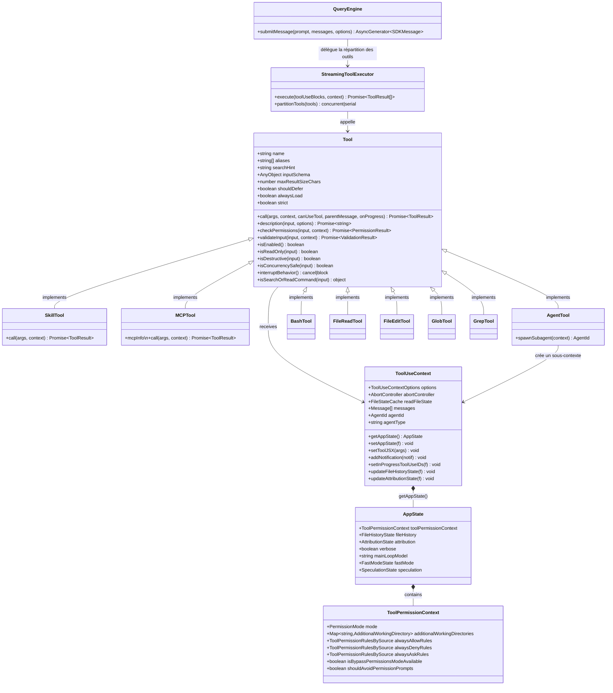
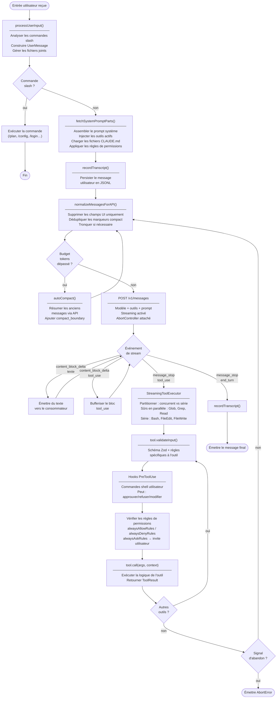
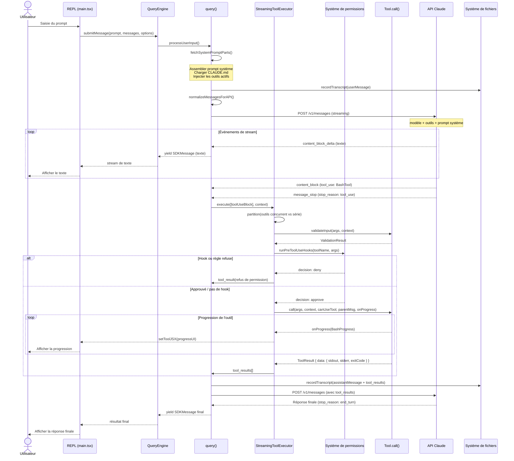

# Claude Code v2.1.88 — Analyse du code source

> **Avertissement** : Tout le code source de ce dépôt est la propriété intellectuelle d'**Anthropic et Claude**. Ce dépôt est fourni strictement à des fins de recherche technique, d'étude et d'échange éducatif entre passionnés. **Toute utilisation commerciale est strictement interdite.** Aucun individu, organisation ou entité ne peut utiliser ce contenu à des fins commerciales, lucratives, illégales ou dans tout autre scénario non autorisé. Si un contenu enfreint vos droits légaux, votre propriété intellectuelle ou d'autres intérêts, veuillez nous contacter et nous le vérifierons et le supprimerons immédiatement.

> Extrait du package npm `@anthropic-ai/claude-code` version **2.1.88**.
> Le package publié ne contient qu'un seul `cli.js` groupé (~12 Mo). Le répertoire `src/` de ce dépôt contient le **code source TypeScript non groupé** extrait de l'archive npm.

**Langue** : [English](README.md) | [中文](README_CN.md) | [한국어](README_KR.md) | [日本語](README_JA.md) | **Français**

---

## Table des matières

- [Rapports d'analyse approfondie (`docs/`)](#rapports-danalyse-approfondie-docs) — Télémétrie, noms de code, mode discret, contrôle à distance, feuille de route
- [Avis sur les modules manquants](#avis-sur-les-modules-manquants-108-modules) — 108 modules contrôlés par feature flag absents du package npm
- [Vue d'ensemble de l'architecture](#vue-densemble-de-larchitecture) — Entrée → Moteur de requête → Outils/Services/État
- [Architecture du système d'outils](#architecture-du-système-doutils) — 40+ outils, flux de permissions, sous-agents
- [Les 12 mécanismes de contrôle progressifs](#les-12-mécanismes-de-contrôle-progressifs) — Comment Claude Code superpose des fonctionnalités de production sur la boucle agent
- [Référence technique approfondie](#référence-technique-approfondie) — Hooks, Skills, Mémoire, Settings, Plugins, Télémétrie
- [Modèles compatibles](#modèles-compatibles) — Tous les modèles, fournisseurs, tarifs, alias et variables d'environnement
- [Modèles open source alternatifs](#modèles-open-source-alternatifs) — 5 modèles OSS, compatibilité API, impacts sur le code source
- [Modèles locaux pour le développement](#modèles-locaux-pour-le-développement) — 5 modèles locaux optimisés coding, ressources matérielles, benchmarks, intégration
- [Diagrammes UML](#diagrammes-uml) — Classes, activité et séquence (Mermaid + PlantUML)
- [Notes de compilation](#notes-de-compilation) — Pourquoi ce source n'est pas directement compilable

---

## Rapports d'analyse approfondie (`docs/`)

Rapports d'analyse du code source issus de la décompilation de la v2.1.88. Disponibles en quatre langues (EN/JA/KO/ZH).

```
docs/
├── en/                                        # English
│   ├── [01-telemetry-and-privacy.md]          # Telemetry & Privacy — what's collected, why you can't opt out
│   ├── [02-hidden-features-and-codenames.md]  # Codenames (Capybara/Tengu/Numbat), feature flags, internal vs external
│   ├── [03-undercover-mode.md]                # Undercover Mode — hiding AI authorship in open-source repos
│   ├── [04-remote-control-and-killswitches.md]# Remote Control — managed settings, killswitches, model overrides
│   └── [05-future-roadmap.md]                 # Future Roadmap — Numbat, KAIROS, voice mode, unreleased tools
│
├── ja/                                        # 日本語
│   ├── [01-テレメトリとプライバシー.md]
│   ├── [02-隠し機能とコードネーム.md]
│   ├── [03-アンダーカバーモード.md]
│   ├── [04-リモート制御とキルスイッチ.md]
│   └── [05-今後のロードマップ.md]
│
├── ko/                                        # 한국어
│   ├── [01-텔레메트리와-프라이버시.md]
│   ├── [02-숨겨진-기능과-코드네임.md]
│   ├── [03-언더커버-모드.md]
│   ├── [04-원격-제어와-킬스위치.md]
│   └── [05-향후-로드맵.md]
│
└── zh/                                        # 中文
    ├── [01-遥测与隐私分析.md]
    ├── [02-隐藏功能与模型代号.md]
    ├── [03-卧底模式分析.md]
    ├── [04-远程控制与紧急开关.md]
    └── [05-未来路线图.md]
```

> Cliquez sur un nom de fichier ci-dessus pour accéder au rapport complet.

| # | Sujet | Points clés |
|---|-------|-------------|
| 01 | **Télémétrie & Confidentialité** | Deux points de collecte analytique (1P → Anthropic, Datadog). Empreinte d'environnement, métriques de processus, hash de dépôt à chaque événement. **Aucune option de désactivation exposée dans l'UI** pour les journaux internes. `OTEL_LOG_TOOL_DETAILS=1` active la capture complète des entrées d'outils. |
| 02 | **Fonctionnalités cachées & Noms de code** | Noms de code animaliers (Capybara v8, Tengu, Fennec→Opus 4.6, **Numbat** suivant). Les feature flags utilisent des paires de mots aléatoires (`tengu_frond_boric`) pour masquer leur objectif. Les utilisateurs internes bénéficient de meilleurs prompts, d'agents de vérification et d'ancres d'effort. Commandes cachées : `/btw`, `/stickers`. |
| 03 | **Mode Discret** | Les employés d'Anthropic entrent automatiquement en mode discret dans les dépôts publics. Le modèle est instruit : *"Ne révélez pas votre couverture"* — supprimez toute attribution à l'IA, écrivez les commits "comme un développeur humain le ferait." **Aucune option de désactivation forcée n'existe.** Soulève des questions de transparence pour les communautés open-source. |
| 04 | **Contrôle à distance** | Interrogation horaire de `/api/claude_code/settings`. Les changements dangereux affichent une boîte de dialogue bloquante — **refuser = fermeture de l'application**. 6+ killswitches (contournement des permissions, mode rapide, mode vocal, collecteur analytique). Les flags GrowthBook peuvent modifier le comportement de n'importe quel utilisateur sans consentement. |
| 05 | **Feuille de route future** | Nom de code **Numbat** confirmé. Opus 4.7 / Sonnet 4.8 en développement. **KAIROS** = mode agent entièrement autonome avec battements cardiaques `<tick>`, notifications push, abonnements aux PR. Mode vocal (push-to-talk) prêt mais contrôlé par flag. 17 outils non publiés découverts. |

---

## Avis sur les modules manquants (108 modules)

> **Ce source est incomplet.** 108 modules référencés par des branches contrôlées par `feature()` ne sont **pas inclus** dans le package npm.
> Ils existent uniquement dans le monodépôt interne d'Anthropic et ont été éliminés par dead-code elimination à la compilation.
> Ils **ne peuvent pas** être récupérés depuis `cli.js`, `sdk-tools.d.ts`, ou tout autre artefact publié.

### Code interne Anthropic (~70 modules, jamais publiés)

Ces modules n'ont aucun fichier source dans le package npm. Il s'agit d'infrastructure interne à Anthropic.

<details>
<summary>Cliquer pour afficher la liste complète</summary>

| Module | Objectif | Feature Gate |
|--------|---------|-------------|
| `daemon/main.js` | Superviseur de démon en arrière-plan | `DAEMON` |
| `daemon/workerRegistry.js` | Registre des workers du démon | `DAEMON` |
| `proactive/index.js` | Système de notifications proactives | `PROACTIVE` |
| `contextCollapse/index.js` | Service de réduction de contexte (expérimental) | `CONTEXT_COLLAPSE` |
| `contextCollapse/operations.js` | Opérations de réduction | `CONTEXT_COLLAPSE` |
| `contextCollapse/persist.js` | Persistance de la réduction | `CONTEXT_COLLAPSE` |
| `skillSearch/featureCheck.js` | Vérification des fonctionnalités de compétences distantes | `EXPERIMENTAL_SKILL_SEARCH` |
| `skillSearch/remoteSkillLoader.js` | Chargeur de compétences distantes | `EXPERIMENTAL_SKILL_SEARCH` |
| `skillSearch/remoteSkillState.js` | État des compétences distantes | `EXPERIMENTAL_SKILL_SEARCH` |
| `skillSearch/telemetry.js` | Télémétrie de recherche de compétences | `EXPERIMENTAL_SKILL_SEARCH` |
| `skillSearch/localSearch.js` | Recherche locale de compétences | `EXPERIMENTAL_SKILL_SEARCH` |
| `skillSearch/prefetch.js` | Prérécupération de compétences | `EXPERIMENTAL_SKILL_SEARCH` |
| `coordinator/workerAgent.js` | Worker de coordination multi-agents | `COORDINATOR_MODE` |
| `bridge/peerSessions.js` | Gestion des sessions pair du bridge | `BRIDGE_MODE` |
| `assistant/index.js` | Mode assistant Kairos | `KAIROS` |
| `assistant/AssistantSessionChooser.js` | Sélecteur de session assistant | `KAIROS` |
| `compact/reactiveCompact.js` | Compaction de contexte réactive | `CACHED_MICROCOMPACT` |
| `compact/snipCompact.js` | Compaction par découpage | `HISTORY_SNIP` |
| `compact/snipProjection.js` | Projection par découpage | `HISTORY_SNIP` |
| `compact/cachedMCConfig.js` | Config de micro-compaction en cache | `CACHED_MICROCOMPACT` |
| `sessionTranscript/sessionTranscript.js` | Service de transcription de session | `TRANSCRIPT_CLASSIFIER` |
| `commands/agents-platform/index.js` | Plateforme d'agents interne | `ant` (interne) |
| `commands/assistant/index.js` | Commande assistant | `KAIROS` |
| `commands/buddy/index.js` | Notifications système Buddy | `BUDDY` |
| `commands/fork/index.js` | Commande de fork de sous-agent | `FORK_SUBAGENT` |
| `commands/peers/index.js` | Commandes multi-pairs | `BRIDGE_MODE` |
| `commands/proactive.js` | Commande proactive | `PROACTIVE` |
| `commands/remoteControlServer/index.js` | Serveur de contrôle à distance | `DAEMON` + `BRIDGE_MODE` |
| `commands/subscribe-pr.js` | Abonnement aux PR GitHub | `KAIROS_GITHUB_WEBHOOKS` |
| `commands/torch.js` | Outil de débogage interne | `TORCH` |
| `commands/workflows/index.js` | Commandes de workflow | `WORKFLOW_SCRIPTS` |
| `jobs/classifier.js` | Classificateur de tâches interne | `TEMPLATES` |
| `memdir/memoryShapeTelemetry.js` | Télémétrie de forme mémoire | `MEMORY_SHAPE_TELEMETRY` |
| `tasks/LocalWorkflowTask/LocalWorkflowTask.js` | Tâche de workflow local | `WORKFLOW_SCRIPTS` |
| `protectedNamespace.js` | Garde d'espace de noms interne | `ant` (interne) |
| `attributionHooks.js` | Hooks d'attribution internes | `COMMIT_ATTRIBUTION` |
| `systemThemeWatcher.js` | Observateur de thème système | `AUTO_THEME` |
| `udsClient.js` / `udsMessaging.js` | Client de messagerie UDS | `UDS_INBOX` |

</details>

### Outils contrôlés par feature flag (~20 modules, supprimés du bundle)

Ces outils ont des signatures de type dans `sdk-tools.d.ts` mais leurs implémentations ont été supprimées à la compilation.

<details>
<summary>Cliquer pour afficher la liste complète</summary>

| Outil | Objectif | Feature Gate |
|-------|---------|-------------|
| `REPLTool` | REPL interactif (sandbox VM) | `ant` (interne) |
| `SnipTool` | Découpage de contexte | `HISTORY_SNIP` |
| `SleepTool` | Pause/délai dans la boucle agent | `PROACTIVE` / `KAIROS` |
| `MonitorTool` | Surveillance MCP | `MONITOR_TOOL` |
| `OverflowTestTool` | Tests de débordement | `OVERFLOW_TEST_TOOL` |
| `WorkflowTool` | Exécution de workflows | `WORKFLOW_SCRIPTS` |
| `WebBrowserTool` | Automatisation du navigateur | `WEB_BROWSER_TOOL` |
| `TerminalCaptureTool` | Capture de terminal | `TERMINAL_PANEL` |
| `TungstenTool` | Surveillance des performances interne | `ant` (interne) |
| `VerifyPlanExecutionTool` | Vérification de plan | `CLAUDE_CODE_VERIFY_PLAN` |
| `SendUserFileTool` | Envoi de fichiers aux utilisateurs | `KAIROS` |
| `SubscribePRTool` | Abonnement aux PR GitHub | `KAIROS_GITHUB_WEBHOOKS` |
| `SuggestBackgroundPRTool` | Suggestion de PR en arrière-plan | `KAIROS` |
| `PushNotificationTool` | Notifications push | `KAIROS` |
| `CtxInspectTool` | Inspection du contexte | `CONTEXT_COLLAPSE` |
| `ListPeersTool` | Liste des pairs actifs | `UDS_INBOX` |
| `DiscoverSkillsTool` | Découverte de compétences | `EXPERIMENTAL_SKILL_SEARCH` |

</details>

### Fichiers texte et assets de prompts (~6 fichiers)

Ces fichiers sont des templates de prompts internes et de la documentation, jamais publiés.

<details>
<summary>Cliquer pour afficher</summary>

| Fichier | Objectif |
|---------|---------|
| `yolo-classifier-prompts/auto_mode_system_prompt.txt` | Prompt système pour le mode automatique |
| `yolo-classifier-prompts/permissions_anthropic.txt` | Prompt de permissions interne Anthropic |
| `yolo-classifier-prompts/permissions_external.txt` | Prompt de permissions utilisateur externe |
| `verify/SKILL.md` | Documentation de compétence de vérification |
| `verify/examples/cli.md` | Exemples de vérification CLI |
| `verify/examples/server.md` | Exemples de vérification serveur |

</details>

### Pourquoi ces modules sont absents

```
  Monodépôt interne Anthropic              Package npm publié
  ──────────────────────────               ─────────────────────
  feature('DAEMON') → true    ──build──→   feature('DAEMON') → false
  ↓                                         ↓
  daemon/main.js  ← INCLUS     ──bundle─→  daemon/main.js  ← SUPPRIMÉ (DCE)
  tools/REPLTool  ← INCLUS     ──bundle─→  tools/REPLTool  ← SUPPRIMÉ (DCE)
  proactive/      ← INCLUS     ──bundle─→  (référencé mais absent de src/)
  ```

  La fonction `feature()` de Bun est un **intrinsèque à la compilation** :
  - Retourne `true` dans la compilation interne d'Anthropic → le code est conservé dans le bundle
  - Retourne `false` dans la compilation publiée → le code est éliminé (dead-code elimination)
  - Les 108 modules n'existent tout simplement pas dans l'artefact publié

---

## Copyright & Avertissement

```
Copyright (c) Anthropic. Tous droits réservés.

Tout le code source de ce dépôt est la propriété intellectuelle d'Anthropic et Claude.
Ce dépôt est fourni strictement à des fins de recherche technique et éducatives.
Toute utilisation commerciale est strictement interdite.

Si vous êtes le titulaire des droits d'auteur et estimez que ce dépôt enfreint vos droits,
veuillez contacter le propriétaire du dépôt pour une suppression immédiate.
```

---

## Statistiques

| Élément | Nombre |
|---------|-------|
| Fichiers sources (.ts/.tsx) | ~1 884 |
| Lignes de code | ~512 664 |
| Fichier le plus volumineux | `query.ts` (~785 Ko) |
| Outils intégrés | ~40+ |
| Commandes slash | ~80+ |
| Dépendances (node_modules) | ~192 packages |
| Runtime | Bun (compilé en bundle Node.js >= 18) |

---

## Le schéma agent

```
                    LA BOUCLE CENTRALE
                    ==================

    Utilisateur --> messages[] --> API Claude --> réponse
                                                |
                                      stop_reason == "tool_use" ?
                                     /                           \
                                   oui                            non
                                    |                              |
                              exécuter outils                retourner texte
                              ajouter tool_result
                              reboucler ──────────────────> messages[]


    C'est la boucle agent minimale. Claude Code enveloppe cette boucle
    avec un système de contrôle de niveau production : permissions, streaming,
    concurrence, compaction, sous-agents, persistance et MCP.
```

---

## Référence des répertoires

```
src/
├── main.tsx                 # Bootstrap du REPL, 4 683 lignes
├── QueryEngine.ts           # Moteur de cycle de vie pour requêtes SDK/headless
├── query.ts                 # Boucle agent principale (785 Ko, fichier le plus volumineux)
├── Tool.ts                  # Interface Tool + fabrique buildTool
├── Task.ts                  # Types de tâches, IDs, base d'état
├── tools.ts                 # Registre d'outils, préréglages, filtrage
├── commands.ts              # Définitions des commandes slash
├── context.ts               # Contexte de l'entrée utilisateur
├── cost-tracker.ts          # Cumul des coûts API
├── setup.ts                 # Flux de configuration initiale
│
├── bridge/                  # Bridge Claude Desktop / distant
│   ├── bridgeMain.ts        #   Gestionnaire de cycle de vie des sessions
│   ├── bridgeApi.ts         #   Client HTTP
│   ├── bridgeConfig.ts      #   Configuration de connexion
│   ├── bridgeMessaging.ts   #   Relais de messages
│   ├── sessionRunner.ts     #   Lancement de processus
│   ├── jwtUtils.ts          #   Rafraîchissement JWT
│   ├── workSecret.ts        #   Jetons d'authentification
│   └── capacityWake.ts      #   Réveil basé sur la capacité
│
├── cli/                     # Infrastructure CLI
│   ├── handlers/            #   Gestionnaires de commandes
│   └── transports/          #   Transports E/S (stdio, structuré)
│
├── commands/                # ~80 commandes slash
│   ├── agents/              #   Gestion des agents
│   ├── compact/             #   Compaction du contexte
│   ├── config/              #   Gestion des paramètres
│   ├── help/                #   Affichage de l'aide
│   ├── login/               #   Authentification
│   ├── mcp/                 #   Gestion des serveurs MCP
│   ├── memory/              #   Système de mémoire
│   ├── plan/                #   Mode planification
│   ├── resume/              #   Reprise de session
│   ├── review/              #   Revue de code
│   └── ...                  #   70+ commandes supplémentaires
│
├── components/              # Interface terminal React/Ink
│   ├── design-system/       #   Primitives UI réutilisables
│   ├── messages/            #   Rendu des messages
│   ├── permissions/         #   Boîtes de dialogue de permissions
│   ├── PromptInput/         #   Champ de saisie + suggestions
│   ├── LogoV2/              #   Branding + écran d'accueil
│   ├── Settings/            #   Panneaux de paramètres
│   ├── Spinner.tsx          #   Indicateurs de chargement
│   └── ...                  #   40+ groupes de composants
│
├── entrypoints/             # Points d'entrée de l'application
│   ├── cli.tsx              #   Principale CLI (version, aide, démon)
│   ├── sdk/                 #   SDK Agent (types, sessions)
│   └── mcp.ts               #   Point d'entrée serveur MCP
│
├── hooks/                   # Hooks React
│   ├── useCanUseTool.tsx    #   Vérification des permissions
│   ├── useReplBridge.tsx    #   Connexion au bridge
│   ├── notifs/              #   Hooks de notification
│   └── toolPermission/      #   Gestionnaires de permissions d'outils
│
├── services/                # Couche logique métier
│   ├── api/                 #   Client API Claude
│   │   ├── claude.ts        #     Appels API en streaming
│   │   ├── errors.ts        #     Catégorisation des erreurs
│   │   └── withRetry.ts     #     Logique de nouvelle tentative
│   ├── analytics/           #   Télémétrie + GrowthBook
│   ├── compact/             #   Compression du contexte
│   ├── mcp/                 #   Gestion des connexions MCP
│   ├── tools/               #   Moteur d'exécution des outils
│   │   ├── StreamingToolExecutor.ts  # Exécuteur d'outils en parallèle
│   │   └── toolOrchestration.ts      # Orchestration par lots
│   ├── plugins/             #   Chargeur de plugins
│   └── settingsSync/        #   Synchronisation des paramètres entre appareils
│
├── state/                   # État de l'application
│   ├── AppStateStore.ts     #   Définition du store
│   └── AppState.tsx         #   Fournisseur React + hooks
│
├── tasks/                   # Implémentations des tâches
│   ├── LocalShellTask/      #   Exécution de commandes Bash
│   ├── LocalAgentTask/      #   Exécution de sous-agents
│   ├── RemoteAgentTask/     #   Agent distant via bridge
│   ├── InProcessTeammateTask/ # Coéquipier en cours de processus
│   └── DreamTask/           #   Réflexion en arrière-plan
│
├── tools/                   # 40+ implémentations d'outils
│   ├── AgentTool/           #   Lancement de sous-agents + fork
│   ├── BashTool/            #   Exécution de commandes shell
│   ├── FileReadTool/        #   Lecture de fichiers (PDF, image, etc.)
│   ├── FileEditTool/        #   Édition par remplacement de chaîne
│   ├── FileWriteTool/       #   Création complète de fichiers
│   ├── GlobTool/            #   Recherche de fichiers par motif
│   ├── GrepTool/            #   Recherche de contenu (ripgrep)
│   ├── WebFetchTool/        #   Récupération HTTP
│   ├── WebSearchTool/       #   Recherche web
│   ├── MCPTool/             #   Wrapper d'outil MCP
│   ├── SkillTool/           #   Invocation de compétences
│   ├── AskUserQuestionTool/ #   Interaction utilisateur
│   └── ...                  #   30+ outils supplémentaires
│
├── types/                   # Définitions de types
│   ├── message.ts           #   Unions discriminantes de messages
│   ├── permissions.ts       #   Types de permissions
│   ├── tools.ts             #   Types de progression des outils
│   └── ids.ts               #   Types d'ID marqués (branded)
│
├── utils/                   # Utilitaires (répertoire le plus volumineux)
│   ├── permissions/         #   Moteur de règles de permissions
│   ├── messages/            #   Formatage des messages
│   ├── model/               #   Logique de sélection du modèle
│   ├── settings/            #   Gestion des paramètres
│   ├── sandbox/             #   Adaptateur de runtime sandbox
│   ├── hooks/               #   Exécution des hooks
│   ├── memory/              #   Utilitaires du système de mémoire
│   ├── git/                 #   Opérations Git
│   ├── github/              #   API GitHub
│   ├── bash/                #   Helpers d'exécution Bash
│   ├── swarm/               #   Essaim multi-agents
│   ├── telemetry/           #   Rapports de télémétrie
│   └── ...                  #   30+ groupes d'utilitaires supplémentaires
│
└── vendor/                  # Stubs de modules natifs
    ├── audio-capture-src/   #   Capture audio
    ├── image-processor-src/ #   Traitement d'images
    ├── modifiers-napi-src/  #   Modificateurs natifs
    └── url-handler-src/     #   Gestion des URLs
```

---

## Vue d'ensemble de l'architecture

```
┌─────────────────────────────────────────────────────────────────────┐
│                        COUCHE D'ENTRÉE                              │
│  cli.tsx ──> main.tsx ──> REPL.tsx (interactif)                    │
│                     └──> QueryEngine.ts (headless/SDK)              │
└──────────────────────────────┬──────────────────────────────────────┘
                               │
                               ▼
┌─────────────────────────────────────────────────────────────────────┐
│                       MOTEUR DE REQUÊTE                             │
│  submitMessage(prompt) ──> AsyncGenerator<SDKMessage>               │
│    │                                                                │
│    ├── fetchSystemPromptParts()    ──> assembler le prompt système  │
│    ├── processUserInput()          ──> gérer les /commandes         │
│    ├── query()                     ──> boucle agent principale      │
│    │     ├── StreamingToolExecutor ──> exécution parallèle d'outils │
│    │     ├── autoCompact()         ──> compression du contexte      │
│    │     └── runTools()            ──> orchestration des outils     │
│    └── yield SDKMessage            ──> diffuser au consommateur     │
└──────────────────────────────┬──────────────────────────────────────┘
                               │
              ┌────────────────┼────────────────┐
              ▼                ▼                 ▼
┌──────────────────┐ ┌─────────────────┐ ┌──────────────────┐
│  SYSTÈME D'OUTILS│ │ COUCHE SERVICES │ │  COUCHE D'ÉTAT   │
│                  │ │                 │ │                  │
│ Interface Tool   │ │ api/claude.ts   │ │ AppState Store   │
│  ├─ call()       │ │  Client API     │ │  ├─ permissions  │
│  ├─ validate()   │ │ compact/        │ │  ├─ fileHistory  │
│  ├─ checkPerms() │ │  auto-compact   │ │  ├─ agents       │
│  ├─ render()     │ │ mcp/            │ │  └─ fastMode     │
│  └─ prompt()     │ │  protocole MCP  │ │                  │
│                  │ │ analytics/      │ │ Contexte React   │
│ 40+ Intégrés :   │ │  télémétrie     │ │  ├─ useAppState  │
│  ├─ BashTool     │ │ tools/          │ │  └─ useSetState  │
│  ├─ FileRead     │ │  exécuteur      │ │                  │
│  ├─ FileEdit     │ │ plugins/        │ └──────────────────┘
│  ├─ Glob/Grep    │ │  chargeur       │
│  ├─ AgentTool    │ │ settingsSync/   │
│  ├─ WebFetch     │ │  multi-appareils│
│  └─ MCPTool      │ │ oauth/          │
│                  │ │  flux d'auth    │
└──────────────────┘ └─────────────────┘
              │                │
              ▼                ▼
┌──────────────────┐ ┌─────────────────┐
│ SYSTÈME DE TÂCHES│ │  COUCHE BRIDGE  │
│                  │ │                 │
│ Types de tâches :│ │ bridgeMain.ts   │
│  ├─ local_bash   │ │  gest. sessions │
│  ├─ local_agent  │ │ bridgeApi.ts    │
│  ├─ remote_agent │ │  client HTTP    │
│  ├─ in_process   │ │ workSecret.ts   │
│  ├─ dream        │ │  jetons auth    │
│  └─ workflow     │ │ sessionRunner   │
│                  │ │  spawn process  │
│ ID: préfixe+8chr │ └─────────────────┘
│  b=bash a=agent  │
│  r=remote t=team │
└──────────────────┘
```

---

## Flux de données : Cycle de vie d'une requête

```
 ENTRÉE UTILISATEUR (prompt / commande slash)
     │
     ▼
 processUserInput()                ← analyser /commandes, construire UserMessage
     │
     ▼
 fetchSystemPromptParts()          ← outils → sections du prompt, mémoire CLAUDE.md
     │
     ▼
 recordTranscript()                ← persister le message utilisateur sur disque (JSONL)
     │
     ▼
 ┌─→ normalizeMessagesForAPI()     ← supprimer les champs UI, compacter si nécessaire
 │   │
 │   ▼
 │   API Claude (streaming)        ← POST /v1/messages avec outils + prompt système
 │   │
 │   ▼
 │   événements de stream          ← message_start → content_block_delta → message_stop
 │   │
 │   ├─ bloc texte ─────────────→ transmettre au consommateur (SDK / REPL)
 │   │
 │   └─ bloc tool_use ?
 │       │
 │       ▼
 │   StreamingToolExecutor         ← partitionner : sûr-concurrent vs série
 │       │
 │       ▼
 │   canUseTool()                  ← vérif. permissions (hooks + règles + invite UI)
 │       │
 │       ├─ REFUS ───────────────→ ajouter tool_result(erreur), continuer la boucle
 │       │
 │       └─ AUTORISATION
 │           │
 │           ▼
 │       tool.call()               ← exécuter l'outil (Bash, Read, Edit, etc.)
 │           │
 │           ▼
 │       ajouter tool_result       ← pousser dans messages[], recordTranscript()
 │           │
 └─────────┘                      ← reboucler vers l'appel API
     │
     ▼ (stop_reason != "tool_use")
 émettre le message de résultat    ← texte final, usage, coût, session_id
```

---

## Architecture du système d'outils

```
                    INTERFACE TOOL
                    ==============

    buildTool(definition) ──> Tool<Input, Output, Progress>

    Chaque outil implémente :
    ┌────────────────────────────────────────────────────────┐
    │  CYCLE DE VIE                                          │
    │  ├── validateInput()      → rejeter les args invalides │
    │  ├── checkPermissions()   → authz spécifique à l'outil │
    │  └── call()               → exécuter et retourner      │
    │                                                        │
    │  CAPACITÉS                                             │
    │  ├── isEnabled()          → vérification feature flag  │
    │  ├── isConcurrencySafe()  → peut s'exécuter en //? │
    │  ├── isReadOnly()         → sans effets de bord ?      │
    │  ├── isDestructive()      → opérations irréversibles ? │
    │  └── interruptBehavior()  → annuler ou bloquer ?       │
    │                                                        │
    │  RENDU (React/Ink)                                     │
    │  ├── renderToolUseMessage()     → affichage des entrées│
    │  ├── renderToolResultMessage()  → affichage des sorties│
    │  ├── renderToolUseProgressMessage() → spinner/statut  │
    │  └── renderGroupedToolUse()     → groupes d'outils //  │
    │                                                        │
    │  CÔTÉ IA                                               │
    │  ├── prompt()             → description outil pour LLM │
    │  ├── description()        → description dynamique      │
    │  └── mapToolResultToAPI() → formater la réponse API    │
    └────────────────────────────────────────────────────────┘
```

### Inventaire complet des outils

```
    OPÉRATIONS FICHIERS      RECHERCHE & DÉCOUVERTE    EXÉCUTION
    ═══════════════════       ══════════════════════    ══════════
    FileReadTool              GlobTool                  BashTool
    FileEditTool              GrepTool                  PowerShellTool
    FileWriteTool             ToolSearchTool
    NotebookEditTool                                    INTERACTION
                                                        ═══════════
    WEB & RÉSEAU             AGENT / TÂCHE             AskUserQuestionTool
    ════════════════         ══════════════════        BriefTool
    WebFetchTool              AgentTool
    WebSearchTool             SendMessageTool           PLANIFICATION & WORKFLOW
                              TeamCreateTool            ════════════════════════
    PROTOCOLE MCP             TeamDeleteTool            EnterPlanModeTool
    ══════════════            TaskCreateTool            ExitPlanModeTool
    MCPTool                   TaskGetTool               EnterWorktreeTool
    ListMcpResourcesTool      TaskUpdateTool            ExitWorktreeTool
    ReadMcpResourceTool       TaskListTool              TodoWriteTool
                              TaskStopTool
                              TaskOutputTool            SYSTÈME
                                                        ════════
                              COMPÉTENCES & EXTENSIONS  ConfigTool
                              ═════════════════════════ SkillTool
                              SkillTool                 ScheduleCronTool
                              LSPTool                   SleepTool
                                                        TungstenTool
```

---

## Système de permissions

```
    DEMANDE D'APPEL D'OUTIL
          │
          ▼
    ┌─ validateInput() ──────────────────────────────────┐
    │  rejeter les entrées invalides avant toute vérif.  │
    └────────────────────┬───────────────────────────────┘
                         │
                         ▼
    ┌─ Hooks PreToolUse ─────────────────────────────────┐
    │  commandes shell définies par l'utilisateur        │
    │  peuvent : approuver, refuser, ou modifier l'entrée│
    └────────────────────┬───────────────────────────────┘
                         │
                         ▼
    ┌─ Règles de permissions ─────────────────────────── ┐
    │  alwaysAllowRules : correspondance → auto-approuver│
    │  alwaysDenyRules  : correspondance → refuser       │
    │  alwaysAskRules   : correspondance → demander      │
    │  Sources : paramètres, args CLI, décisions session │
    └────────────────────┬───────────────────────────────┘
                         │
                    pas de règle ?
                         │
                         ▼
    ┌─ Invite interactive ───────────────────────────────┐
    │  L'utilisateur voit le nom de l'outil + l'entrée   │
    │  Options : Autoriser une fois / Toujours / Refuser │
    └────────────────────┬───────────────────────────────┘
                         │
                         ▼
    ┌─ checkPermissions() ───────────────────────────────┐
    │  Logique spécifique à l'outil (ex. sandboxing)     │
    └────────────────────┬───────────────────────────────┘
                         │
                    APPROUVÉ → tool.call()
```

---

## Architecture sous-agents & multi-agents

```
                        AGENT PRINCIPAL
                        ===============
                            │
            ┌───────────────┼───────────────┐
            ▼               ▼               ▼
     ┌──────────────┐ ┌──────────┐ ┌──────────────┐
     │  AGENT FORK  │ │ AGENT    │ │ COÉQUIPIER   │
     │              │ │ DISTANT  │ │ EN-PROCESSUS │
     │ Fork process │ │ Bridge   │ │ Même process │
     │ Cache partagé│ │ session  │ │ Contexte async│
     │ msgs[] neufs │ │ Isolé    │ │ État partagé │
     └──────────────┘ └──────────┘ └──────────────┘

    MODES DE LANCEMENT :
    ├─ default    → en-processus, conversation partagée
    ├─ fork       → processus enfant, messages[] neufs, cache fichiers partagé
    ├─ worktree   → worktree git isolé + fork
    └─ remote     → bridge vers Claude Code Remote / conteneur

    COMMUNICATION :
    ├─ SendMessageTool     → messages agent-à-agent
    ├─ TaskCreate/Update   → tableau de tâches partagé
    └─ TeamCreate/Delete   → gestion du cycle de vie d'équipe

    MODE ESSAIM (contrôlé par feature flag) :
    ┌─────────────────────────────────────────────┐
    │  Agent coordinateur                         │
    │    ├── Coéquipier A ──> revendique Tâche 1  │
    │    ├── Coéquipier B ──> revendique Tâche 2  │
    │    └── Coéquipier C ──> revendique Tâche 3  │
    │                                             │
    │  Partagé : tableau de tâches, boîte de réception│
    │  Isolé : messages[], cache fichiers, cwd    │
    └─────────────────────────────────────────────┘
```

---

## Gestion du contexte (Système de compaction)

```
    BUDGET DE FENÊTRE DE CONTEXTE
    ═════════════════════════════

    ┌─────────────────────────────────────────────────────┐
    │  Prompt système (outils, permissions, CLAUDE.md)    │
    │  ══════════════════════════════════════════════      │
    │                                                     │
    │  Historique de conversation                         │
    │  ┌─────────────────────────────────────────────┐    │
    │  │ [résumé compacté des anciens messages]       │    │
    │  │ ═══════════════════════════════════════════  │    │
    │  │ [marqueur compact_boundary]                  │    │
    │  │ ─────────────────────────────────────────── │    │
    │  │ [messages récents — fidélité complète]       │    │
    │  │ user → assistant → tool_use → tool_result   │    │
    │  └─────────────────────────────────────────────┘    │
    │                                                     │
    │  Tour actuel (user + réponse assistant)             │
    └─────────────────────────────────────────────────────┘

    TROIS STRATÉGIES DE COMPRESSION :
    ├─ autoCompact     → déclenché quand le nombre de tokens dépasse le seuil
    │                     résume les anciens messages via un appel API compact
    ├─ snipCompact     → supprime les messages zombie et marqueurs obsolètes
    │                     (feature flag HISTORY_SNIP)
    └─ contextCollapse → restructure le contexte pour plus d'efficacité
                         (feature flag CONTEXT_COLLAPSE)
```

---

## Intégration MCP (Protocole de Contexte de Modèle)

```
    ┌─────────────────────────────────────────────────────────┐
    │              ARCHITECTURE MCP                            │
    │                                                         │
    │  MCPConnectionManager.tsx                               │
    │    ├── Découverte de serveurs (config de settings.json) │
    │    │     ├── stdio  → lancer un processus enfant        │
    │    │     ├── sse    → HTTP EventSource                  │
    │    │     ├── http   → HTTP streamable                   │
    │    │     ├── ws     → WebSocket                         │
    │    │     └── sdk    → transport en-processus            │
    │    │                                                    │
    │    ├── Cycle de vie du client                           │
    │    │     ├── connecter → initialiser → lister les outils│
    │    │     ├── appels d'outils via wrapper MCPTool         │
    │    │     └── déconnecter / reconnecter avec backoff     │
    │    │                                                    │
    │    ├── Authentification                                 │
    │    │     ├── Flux OAuth 2.0 (McpOAuthConfig)            │
    │    │     ├── Accès Cross-App (XAA / SEP-990)            │
    │    │     └── Clé API via headers                        │
    │    │                                                    │
    │    └── Enregistrement des outils                        │
    │          ├── Convention de nommage mcp__<serveur>__<outil>│
    │          ├── Schéma dynamique depuis le serveur MCP     │
    │          ├── Transmission des permissions Claude Code   │
    │          └── Listing des ressources (ListMcpResourcesTool)│
    │                                                         │
    └─────────────────────────────────────────────────────────┘
```

---

## Couche Bridge (Claude Desktop / Distant)

```
    Claude Desktop / Web / Cowork          Claude Code CLI
    ══════════════════════════            ═════════════════

    ┌───────────────────┐                 ┌──────────────────┐
    │  Client Bridge    │  ←─ HTTP ──→   │  bridgeMain.ts   │
    │  (App Desktop)    │                 │                  │
    └───────────────────┘                 │  Gestionnaire    │
                                          │  de sessions     │
    PROTOCOLE :                           │  ├── spawn CLI   │
    ├─ Auth JWT                           │  ├── poll statut │
    ├─ Échange work secret                │  ├── relais msgs │
    ├─ Cycle de vie session               │  └── capacityWake│
    │  ├── créer                          │                  │
    │  ├── exécuter                       │  Backoff :       │
    │  └─ arrêter                         │  ├─ conn: 2s→2m  │
    └─ Planificateur de rafraîch. token   │  └─ gen: 500ms→30s│
                                          └──────────────────┘
```

---

## Persistance des sessions

```
    STOCKAGE DE SESSION
    ══════════════════

    ~/.claude/projects/<hash>/sessions/
    └── <session-id>.jsonl           ← journal en ajout seulement
        ├── {"type":"user",...}
        ├── {"type":"assistant",...}
        ├── {"type":"progress",...}
        └── {"type":"system","subtype":"compact_boundary",...}

    FLUX DE REPRISE :
    getLastSessionLog() ──> analyser JSONL ──> reconstruire messages[]
         │
         ├── --continue     → dernière session dans le cwd
         ├── --resume <id>  → session spécifique
         └── --fork-session → nouvel ID, copie de l'historique

    STRATÉGIE DE PERSISTANCE :
    ├─ Messages utilisateur  → écriture en attente (bloquant, pour récupération crash)
    ├─ Messages assistant    → fire-and-forget (file avec préservation de l'ordre)
    ├─ Progress              → écriture inline (déduplication à la prochaine requête)
    └─ Flush                 → à l'émission du résultat / flush anticipé cowork
```

---

## Système de feature flags

```
    DEAD CODE ELIMINATION (intrinsèque à la compilation Bun)
    ══════════════════════════════════════════════════════════

    feature('NOM_FLAG')  ──→  true  → inclus dans le bundle
                          ──→  false → supprimé du bundle

    FLAGS (observés dans le source) :
    ├─ COORDINATOR_MODE      → coordinateur multi-agents
    ├─ HISTORY_SNIP          → élagage agressif de l'historique
    ├─ CONTEXT_COLLAPSE      → restructuration du contexte
    ├─ DAEMON                → workers démon en arrière-plan
    ├─ AGENT_TRIGGERS        → déclencheurs cron/distants
    ├─ AGENT_TRIGGERS_REMOTE → support de déclencheurs distants
    ├─ MONITOR_TOOL          → outil de surveillance MCP
    ├─ WEB_BROWSER_TOOL      → automatisation du navigateur
    ├─ VOICE_MODE            → entrée/sortie vocale
    ├─ TEMPLATES             → classificateur de tâches
    ├─ EXPERIMENTAL_SKILL_SEARCH → découverte de compétences
    ├─ KAIROS                → notifications push, envoi de fichiers
    ├─ PROACTIVE             → outil sleep, comportement proactif
    ├─ OVERFLOW_TEST_TOOL    → outil de test
    ├─ TERMINAL_PANEL        → capture de terminal
    ├─ WORKFLOW_SCRIPTS      → outil de workflow
    ├─ CHICAGO_MCP           → computer use MCP
    ├─ DUMP_SYSTEM_PROMPT    → extraction de prompt (ant uniquement)
    ├─ UDS_INBOX             → découverte de pairs
    ├─ ABLATION_BASELINE     → ablation d'expérience
    └─ UPGRADE_NOTICE        → notifications de mise à jour

    CONTRÔLES RUNTIME :
    ├─ process.env.USER_TYPE === 'ant'  → fonctionnalités internes Anthropic
    └─ Feature flags GrowthBook         → expériences A/B à l'exécution
```

---

## Gestion de l'état

```
    ┌──────────────────────────────────────────────────────────┐
    │                  AppState Store                           │
    │                                                          │
    │  AppState {                                              │
    │    toolPermissionContext: {                              │
    │      mode: PermissionMode,          ← default/plan/etc  │
    │      additionalWorkingDirectories,                       │
    │      alwaysAllowRules,              ← auto-approuver     │
    │      alwaysDenyRules,               ← auto-refuser       │
    │      alwaysAskRules,                ← toujours demander  │
    │      isBypassPermissionsModeAvailable                    │
    │    },                                                    │
    │    fileHistory: FileHistoryState,   ← snapshots undo     │
    │    attribution: AttributionState,   ← suivi des commits  │
    │    verbose: boolean,                                     │
    │    mainLoopModel: string,           ← modèle actif       │
    │    fastMode: FastModeState,                              │
    │    speculation: SpeculationState                         │
    │  }                                                       │
    │                                                          │
    │  Intégration React :                                     │
    │  ├── AppStateProvider   → crée le store via createContext│
    │  ├── useAppState(sel)   → souscriptions par sélecteur   │
    │  └── useSetAppState()   → updater style immer           │
    └──────────────────────────────────────────────────────────┘
```

---

## Les 12 mécanismes de contrôle progressifs

Ce code source illustre 12 mécanismes superposés qu'un système de contrôle d'agent IA de niveau production nécessite au-delà de la boucle de base. Chacun s'appuie sur le précédent :

```
    s01  LA BOUCLE             "Une boucle & Bash suffisent"
         query.ts : la boucle while-true qui appelle l'API Claude,
         vérifie stop_reason, exécute les outils, ajoute les résultats.

    s02  DISPATCH D'OUTILS     "Ajouter un outil = ajouter un gestionnaire"
         Tool.ts + tools.ts : chaque outil s'enregistre dans la table
         de dispatch. La boucle reste identique. La fabrique buildTool()
         fournit des valeurs par défaut sécurisées.

    s03  PLANIFICATION         "Un agent sans plan dérive"
         EnterPlanModeTool/ExitPlanModeTool + TodoWriteTool :
         lister les étapes d'abord, puis exécuter. Double le taux d'achèvement.

    s04  SOUS-AGENTS           "Décomposer les grandes tâches ; contexte propre"
         AgentTool + forkSubagent.ts : chaque enfant reçoit des messages[]
         neufs, gardant la conversation principale propre.

    s05  CONNAISSANCE À LA DEMANDE "Charger les connaissances quand nécessaire"
         SkillTool + memdir/ : injecter via tool_result, pas le prompt système.
         Fichiers CLAUDE.md chargés paresseusement par répertoire.

    s06  COMPRESSION DU CONTEXTE "Le contexte se remplit ; faire de la place"
         services/compact/ : stratégie en trois couches :
         autoCompact (résumer) + snipCompact (élaguer) + contextCollapse

    s07  TÂCHES PERSISTANTES   "Grands objectifs → petites tâches → disque"
         TaskCreate/Update/Get/List : graphe de tâches basé sur fichiers avec
         suivi de statut, dépendances et persistance.

    s08  TÂCHES EN ARRIÈRE-PLAN "Ops lentes en arrière-plan ; l'agent continue"
         DreamTask + LocalShellTask : threads démons exécutent les commandes,
         injectent des notifications à la complétion.

    s09  ÉQUIPES D'AGENTS      "Trop grand pour un seul → déléguer aux coéquipiers"
         TeamCreate/Delete + InProcessTeammateTask : coéquipiers persistants
         avec boîtes aux lettres asynchrones.

    s10  PROTOCOLES D'ÉQUIPE   "Règles de communication partagées"
         SendMessageTool : un schéma requête-réponse pilote
         toutes les négociations entre agents.

    s11  AGENTS AUTONOMES      "Les coéquipiers scannent et revendiquent eux-mêmes"
         coordinator/coordinatorMode.ts : cycle inactif + auto-revendication,
         pas besoin que le coordinateur assigne chaque tâche.

    s12  ISOLATION PAR WORKTREE "Chacun travaille dans son propre répertoire"
         EnterWorktreeTool/ExitWorktreeTool : les tâches gèrent les objectifs,
         les worktrees gèrent les répertoires, liés par ID.
```

---

## Patrons de conception clés

| Patron | Localisation | Objectif |
|--------|-------------|---------|
| **Streaming AsyncGenerator** | `QueryEngine`, `query()` | Streaming bout-en-bout de l'API au consommateur |
| **Builder + Factory** | `buildTool()` | Valeurs par défaut sécurisées pour les définitions d'outils |
| **Types brandés** | `SystemPrompt`, `asSystemPrompt()` | Éviter la confusion chaîne/tableau |
| **Feature Flags + DCE** | `feature()` de `bun:bundle` | Élimination de code mort à la compilation |
| **Unions discriminantes** | Types `Message` | Gestion des messages typée sûre |
| **Observer + Machine d'état** | `StreamingToolExecutor` | Suivi du cycle de vie d'exécution des outils |
| **État snapshot** | `FileHistoryState` | Annulation/rétablissement des opérations sur fichiers |
| **Buffer circulaire** | Journal des erreurs | Mémoire bornée pour les longues sessions |
| **Écriture fire-and-forget** | `recordTranscript()` | Persistance non-bloquante avec ordonnancement |
| **Schéma paresseux** | `lazySchema()` | Reporter l'évaluation du schéma Zod pour la performance |
| **Isolation de contexte** | `AsyncLocalStorage` | Contexte par-agent dans un processus partagé |

---

## Notes de compilation

Ce source **n'est pas directement compilable** depuis ce dépôt seul :

- `tsconfig.json`, scripts de compilation et configuration du bundler Bun manquants dans ce README d'origine (présents dans le dépôt)
- Les appels `feature()` sont des intrinsèques à la compilation Bun — résolus lors du bundling
- `MACRO.VERSION` est injecté à la compilation
- Les sections `process.env.USER_TYPE === 'ant'` sont internes à Anthropic
- Le `cli.js` compilé est un bundle autonome de 12 Mo ne nécessitant que Node.js >= 18
- Les source maps (`cli.js.map`, 60 Mo) font référence à ces fichiers sources pour le débogage

**Voir [QUICKSTART.md](QUICKSTART.md) pour les instructions de compilation et les contournements.**

---

## Modèles open source alternatifs

Claude Code est architecturé autour de l'API Anthropic Messages, mais son contrat d'interface est suffisamment standard pour être proxifié. Cette section analyse cinq modèles open source pouvant remplacer les modèles Anthropic, et détaille l'impact sur le code source.

### Stratégie d'intégration : proxy Anthropic-compatible

La voie principale est un **proxy LiteLLM** (ou équivalent) pointé via `ANTHROPIC_BASE_URL`. Le code le mentionne explicitement dans `src/utils/api.ts` :

```typescript
// Proxy gateways (ANTHROPIC_BASE_URL → LiteLLM → Bedrock) reject
// cache_control blocks — stripped conditionally when not first-party
```

```bash
# Configuration minimale pour utiliser un modèle OSS via LiteLLM
ANTHROPIC_BASE_URL=http://localhost:4000   # endpoint LiteLLM
ANTHROPIC_API_KEY=sk-fake-key             # LiteLLM n'exige pas de vraie clé Anthropic
ANTHROPIC_MODEL=ollama/deepseek-coder-v2  # nom de modèle tel que LiteLLM le connaît
```

### Les 5 modèles open source recommandés

| # | Modèle | Licence | Contexte | Tool Use | Reasoning | Taille |
|---|---|---|---|---|---|---|
| 1 | **DeepSeek-V3** | DeepSeek (usage libre) | 128K | ✅ natif | ❌ | 685B (MoE) |
| 2 | **Llama 3.3 70B Instruct** | Meta Llama 3.3 Community | 128K | ✅ natif | ❌ | 70B dense |
| 3 | **Qwen2.5-Coder-32B-Instruct** | Apache 2.0 | 128K | ✅ natif | ❌ | 32B dense |
| 4 | **DeepSeek-R1** | MIT | 64K–128K | ✅ natif | ✅ `<think>` | 671B (MoE) |
| 5 | **Phi-4** | MIT | 16K | ✅ natif | ❌ | 14B dense |

---

#### 1. DeepSeek-V3

**Licence** : DeepSeek License Agreement (usage commercial libre, redistribution restreinte)  
**Dépôt** : [deepseek-ai/DeepSeek-V3](https://huggingface.co/deepseek-ai/DeepSeek-V3)  
**Hébergement** : DeepSeek API, Together AI, Fireworks AI, vLLM local

DeepSeek-V3 est un modèle Mixture-of-Experts 685 milliards de paramètres (37B actifs par token). Il excelle dans les tâches de codage complexes et atteint ou dépasse GPT-4o sur les benchmarks code (HumanEval, SWE-bench Verified). Son architecture MoE le rend très efficace à l'inférence.

**Points forts pour Claude Code :**
- Performances de codage très proches de Claude Sonnet 4.6
- Excellent suivi d'instructions complexes multi-étapes
- Tool use fiable (function calling natif)
- Disponible en API publique à faible coût

**Limites :**
- Pas de blocs `thinking` au format Anthropic (incompatible avec `--thinking enabled`)
- Contexte 128K (pas de variante 1M)
- Pas de prompt caching natif au format Anthropic

---

#### 2. Meta Llama 3.3 70B Instruct

**Licence** : Meta Llama 3.3 Community License (commerciale autorisée sous 700M utilisateurs/mois)  
**Dépôt** : [meta-llama/Llama-3.3-70B-Instruct](https://huggingface.co/meta-llama/Llama-3.3-70B-Instruct)  
**Hébergement** : Ollama, vLLM, Groq, Together AI, Fireworks AI

Llama 3.3 70B est le modèle polyvalent de référence de la communauté open source. Il offre d'excellentes performances à sa taille, avec un bon équilibre entre vitesse et qualité sur les tâches de développement courant.

**Points forts pour Claude Code :**
- Très bien supporté par Ollama et vLLM — facile à déployer localement
- Bon équilibre vitesse/qualité pour les tâches de codage simples à modérées
- Écosystème mature, nombreux guides d'intégration LiteLLM
- Déploiement 100% local = aucune fuite de données

**Limites :**
- Suivi d'instructions multi-étapes moins fiable que les modèles plus grands
- Hallucinations d'appels d'outils plus fréquentes
- Moins performant sur les refactorisations complexes ou la compréhension de grandes bases de code

---

#### 3. Qwen2.5-Coder-32B-Instruct

**Licence** : Apache 2.0 (commerciale, redistribution totalement libre)  
**Dépôt** : [Qwen/Qwen2.5-Coder-32B-Instruct](https://huggingface.co/Qwen/Qwen2.5-Coder-32B-Instruct)  
**Hébergement** : Ollama, vLLM, Fireworks AI, SiliconFlow

Qwen2.5-Coder-32B est actuellement le meilleur modèle open source spécialisé code avec une licence véritablement permissive (Apache 2.0). Il atteint des performances proches de GPT-4o sur les benchmarks de coding purs (HumanEval 92.7%, MBPP 90.2%).

**Points forts pour Claude Code :**
- **Meilleure licence** : Apache 2.0, aucune restriction commerciale
- Spécialisé code : complétion, correction, documentation, tests
- Très bon suivi des instructions de type `FileEdit`, `FileWrite`, `Bash`
- Léger pour un modèle 32B : déploiement local sur GPU grand public (2×RTX 4090 en Q4)

**Limites :**
- Moins polyvalent pour les tâches conversationnelles non-code
- Pas de reasoning étendu
- Contexte 128K

---

#### 4. DeepSeek-R1

**Licence** : MIT (totalement libre, commerciale et redistribution)  
**Dépôt** : [deepseek-ai/DeepSeek-R1](https://huggingface.co/deepseek-ai/DeepSeek-R1)  
**Hébergement** : DeepSeek API, Together AI, vLLM local (version 671B), versions distillées 7B–70B via Ollama

DeepSeek-R1 est le modèle de raisonnement open source le plus avancé disponible. Il utilise des chaînes de pensée longues via des balises `<think>...</think>` dans sa réponse. C'est le plus proche fonctionnellement des capacités de raisonnement étendu de Claude (`--thinking enabled`).

**Points forts pour Claude Code :**
- **Meilleure licence** : MIT, totalement libre
- Raisonnement chain-of-thought explicite (utile pour les tâches complexes d'architecture)
- Excellentes performances sur les tâches de débogage difficiles
- Distillations plus petites (7B, 14B, 32B, 70B) disponibles via Ollama

**Limites :**
- Format de thinking (`<think>` tags) incompatible avec les blocs `thinking` Anthropic → pas d'affichage dans l'UI
- Les balises `<think>` peuvent polluer le contenu texte si le proxy ne les filtre pas
- Contexte 64K–128K selon la version
- Temps de réponse plus longs (raisonnement étendu)

---

#### 5. Phi-4

**Licence** : MIT  
**Dépôt** : [microsoft/phi-4](https://huggingface.co/microsoft/phi-4)  
**Hébergement** : Ollama, vLLM, Azure AI Foundry, Hugging Face Inference

Phi-4 (14B paramètres) de Microsoft est remarquablement performant pour sa taille. Il excelle sur les benchmarks de raisonnement mathématique et code, surpassant des modèles deux à quatre fois plus grands sur certaines tâches. Idéal pour un déploiement local sur matériel limité (fonctionne sur un seul GPU RTX 3090).

**Points forts pour Claude Code :**
- **Très léger** : déploiement local sur GPU grand public (16 Go VRAM en Q4)
- MIT license
- Bon pour les tâches de codage simples à modérées
- Faible latence pour les interactions rapides

**Limites :**
- Contexte 16K : **incompatible avec les longues sessions** et bases de code volumineuses
- Moins fiable sur les tâches de coding complexes multi-fichiers
- Ne peut pas gérer les gros prompts systèmes de Claude Code (>8K tokens)

---

### Impact sur le code source

#### Tableau de compatibilité

| Fonctionnalité | Fichier source | DeepSeek-V3 | Llama 3.3 | Qwen2.5-Coder | DeepSeek-R1 | Phi-4 |
|---|---|---|---|---|---|---|
| API de base | `src/services/api/client.ts` | ✅ via proxy | ✅ via proxy | ✅ via proxy | ✅ via proxy | ✅ via proxy |
| Tool use | `src/query.ts` | ✅ | ✅ | ✅ | ✅ | ✅ |
| Thinking blocks | `src/utils/thinking.ts` | ❌ | ❌ | ❌ | ⚠️ format différent | ❌ |
| Prompt caching | `src/utils/api.ts` | ❌ | ❌ | ❌ | ❌ | ❌ |
| Contexte 1M | `src/utils/context.ts` | ❌ | ❌ | ❌ | ❌ | ❌ |
| Structured outputs | `src/utils/betas.ts` | ⚠️ | ⚠️ | ⚠️ | ⚠️ | ❌ |
| Coût calculé | `src/utils/modelCost.ts` | ❌ inconnu | ❌ inconnu | ❌ inconnu | ❌ inconnu | ❌ inconnu |
| Affichage modèle | `src/utils/model/model.ts` | ❌ nom brut | ❌ nom brut | ❌ nom brut | ❌ nom brut | ❌ nom brut |

#### Impacts par couche du code source

**`src/services/api/client.ts`**  
Aucune modification nécessaire. L'instanciation du client `Anthropic` utilise automatiquement `ANTHROPIC_BASE_URL` si défini. LiteLLM exposant un endpoint compatible Anthropic, tous les appels sont transparents.

**`src/utils/model/configs.ts`**  
Pour une intégration propre, ajouter une entrée dans `ALL_MODEL_CONFIGS` :

```typescript
// Exemple pour DeepSeek-V3 via LiteLLM
export const DEEPSEEK_V3_CONFIG = {
  firstParty: 'deepseek-v3',
  bedrock: 'deepseek-v3',      // non disponible natif
  vertex: 'deepseek-v3',       // non disponible natif
  foundry: 'deepseek-v3',
} as const satisfies ModelConfig

// Dans ALL_MODEL_CONFIGS :
// deepseekV3: DEEPSEEK_V3_CONFIG,
```

Sans cette entrée, le modèle fonctionnera mais apparaîtra sous son nom brut dans l'UI et le coût sera inconnu.

**`src/utils/modelCost.ts`**  
Ajouter les tarifs pour que le compteur USD s'affiche correctement. Pour les modèles locaux, définir à 0 :

```typescript
// Modèle local gratuit
const COST_FREE = { inputTokens: 0, outputTokens: 0,
  promptCacheWriteTokens: 0, promptCacheReadTokens: 0, webSearchRequests: 0 }

// Dans MODEL_COSTS :
// 'deepseek-v3': { inputTokens: 0.27, outputTokens: 1.10, ... }
// 'llama-3.3-70b': COST_FREE,  // si déploiement local
```

**`src/utils/context.ts`**  
`MODEL_CONTEXT_WINDOW_DEFAULT = 200_000` sera appliqué par défaut. Pour les modèles avec moins de 200K tokens (notamment Phi-4 à 16K), la compaction automatique échouera ou sera déclenchée trop tard. Correctif recommandé :

```bash
# Variable supportée par tous les utilisateurs (pas seulement ant)
export CLAUDE_CODE_MAX_CONTEXT_TOKENS=16000   # pour Phi-4
export CLAUDE_CODE_MAX_CONTEXT_TOKENS=128000  # pour la plupart des modèles OSS
```

Pour Phi-4, définir `CLAUDE_CODE_DISABLE_AUTO_MEMORY=1` et éviter les sessions longues.

**`src/utils/api.ts`**  
La gestion du `cache_control` est automatiquement désactivée quand `ANTHROPIC_BASE_URL` pointe vers un proxy non-Anthropic (le code le détecte via `isFirstPartyAnthropicBaseUrl()`). Aucune modification nécessaire.

**`src/utils/betas.ts`**  
`modelSupportsStructuredOutputs()` retourne `false` pour les modèles inconnus. Les fonctionnalités basées sur les structured outputs (JSON Schema via `--json-schema`) nécessiteraient un override explicite :

```typescript
// Ajouter dans modelSupportsStructuredOutputs() :
if (canonical.includes('deepseek-v3') || canonical.includes('qwen2.5-coder')) {
  return true  // si LiteLLM supporte le format
}
```

**`src/utils/thinking.ts`** / **`src/utils/model/antModels.ts`**  
Les blocs `thinking` Anthropic ne sont pas supportés par les modèles OSS. Le code désactive déjà thinking par défaut dans les hooks, compaction et sous-agents (`thinkingConfig: { type: 'disabled' }`). Pour l'interface principale, passer `--thinking disabled` ou laisser le défaut (thinking désactivé pour PAYG).

Pour DeepSeek-R1, les balises `<think>` dans la réponse texte seront rendues telles quelles dans le terminal — un hook `PostToolUse` ou une étape LiteLLM de post-traitement peut les filtrer si souhaité.

**`src/utils/toolSearch.ts`**  
Le tool search est désactivé pour les proxies non-Anthropic. Pour l'activer explicitement :

```bash
ENABLE_TOOL_SEARCH=true
```

**`src/utils/model/model.ts`** — `getPublicModelDisplayName()`  
Retourne `null` pour les modèles inconnus → l'ID brut s'affiche dans le status bar. Cosmétique uniquement.

---

### Configuration pas à pas avec LiteLLM

```bash
# 1. Installer LiteLLM
pip install litellm[proxy]

# 2. Créer litellm_config.yaml
cat > litellm_config.yaml << 'EOF'
model_list:
  - model_name: deepseek-v3
    litellm_params:
      model: deepseek/deepseek-chat
      api_key: YOUR_DEEPSEEK_API_KEY

  - model_name: qwen2.5-coder-32b
    litellm_params:
      model: ollama/qwen2.5-coder:32b
      api_base: http://localhost:11434

  - model_name: llama-3.3-70b
    litellm_params:
      model: ollama/llama3.3:70b
      api_base: http://localhost:11434
EOF

# 3. Démarrer le proxy
litellm --config litellm_config.yaml --port 4000

# 4. Configurer Claude Code
export ANTHROPIC_BASE_URL=http://localhost:4000
export ANTHROPIC_API_KEY=sk-litellm-proxy
export ANTHROPIC_MODEL=deepseek-v3
export ANTHROPIC_DEFAULT_SONNET_MODEL=deepseek-v3
export ANTHROPIC_DEFAULT_HAIKU_MODEL=qwen2.5-coder-32b
export ANTHROPIC_DEFAULT_SONNET_MODEL_SUPPORTED_CAPABILITIES=effort
# Désactiver les fonctionnalités incompatibles
export CLAUDE_CODE_DISABLE_1M_CONTEXT=1
# Ajuster la fenêtre de contexte si le modèle < 200K tokens (ex. Phi-4 = 16K)
export CLAUDE_CODE_MAX_CONTEXT_TOKENS=128000  # pour modèles 128K

# 5. Lancer Claude Code
claude
```

### Contrat de streaming requis par le proxy

Pour qu'un proxy soit pleinement compatible, il doit émettre les événements SSE suivants dans l'ordre exact :

| Événement SSE | Champs obligatoires | Utilisation dans Claude Code |
|---|---|---|
| `message_start` | `message.id`, `message.usage.input_tokens`, `message.content: []` | Initialise le compteur de tokens |
| `content_block_start` | `index`, `content_block.type` (`text`\|`tool_use`\|`thinking`) | Alloue le bloc en mémoire |
| `content_block_delta` | `index`, `delta.type` (`text_delta`\|`input_json_delta`\|`thinking_delta`\|`signature_delta`) | Accumule le contenu en streaming |
| `content_block_stop` | `index` | Finalise et yield le bloc |
| `message_delta` | `delta.stop_reason` (`end_turn`\|`tool_use`), `usage.output_tokens` | Déclenche la boucle d'outils |

> **Point critique** : les appels d'outils (`tool_use`) doivent streamer leur contenu JSON via `input_json_delta` (fragments de string JSON), **pas** en envoyant l'objet JSON complet en une fois. De plus, les blocs `thinking` nécessitent un champ `signature` pour validation d'intégrité — si un proxy traduit les balises `<think>` de DeepSeek-R1 en blocs thinking Anthropic, il doit synthétiser une signature valide (ou la laisser vide, ce qui désactive la validation côté Claude Code).

> **Note sur stop_reason** : le code source (`src/query.ts`) mentionne explicitement que `stop_reason === 'tool_use'` est parfois incorrect. La détection des appels d'outils se fait en pratique par inspection des blocs `content` du type `tool_use`, ce qui améliore la tolérance aux proxies imparfaits.

---

### Résumé des recommandations

| Cas d'usage | Modèle recommandé | Raison |
|---|---|---|
| **Meilleure qualité OSS** | DeepSeek-V3 | Performances proches de Claude Sonnet 4.6 |
| **Tâches de codage pures** | Qwen2.5-Coder-32B | Spécialisé code, Apache 2.0 |
| **Déploiement local** | Llama 3.3 70B | Meilleur support Ollama, communauté mature |
| **Raisonnement complexe** | DeepSeek-R1 | Chain-of-thought, MIT license |
| **Matériel limité** | Phi-4 (14B) | Une seule GPU 16 Go, MIT license |

---

## Modèles locaux pour le développement

Cette section présente **5 modèles d'IA exécutables localement** sur un ordinateur personnel, spécifiquement sélectionnés pour les tâches de développement. Chaque modèle est analysé selon ses exigences matérielles, ses performances en coding et sa compatibilité avec l'architecture de Claude Code.

> Ces modèles s'ajoutent aux 5 modèles OSS déjà décrits dans la section précédente (DeepSeek-V3, Llama 3.3 70B, Qwen2.5-Coder-32B, DeepSeek-R1, Phi-4).

### Vue d'ensemble des 5 modèles locaux

| # | Modèle | Taille | Licence | Contexte | Tool Use | Thinking | VRAM min |
|---|---|---|---|---|---|---|---|
| 1 | **OmniCoder-9B** (Tesslate) | 9B | **Apache 2.0** | **262K** | ✅ natif | ✅ `<think>` | 6 GB |
| 2 | **Mistral-Nemo 12B** (Mistral+NVIDIA) | 12B | **Apache 2.0** | **128K** | ✅ natif | ❌ | 8 GB |
| 3 | **Yi-Coder-9B-Chat** (01.ai) | 9B | Apache 2.0 | **128K** | ⚠️ partiel | ❌ | 6 GB |
| 4 | **CodeGemma-7B-IT** (Google) | 7B | Gemma (permissif) | 8K | ⚠️ partiel | ❌ | 5 GB |
| 5 | **OpenCoder-8B-Instruct** (InfiniAI) | 8B | **MIT** | 8K | ⚠️ partiel | ❌ | 6 GB |

---

### Modèle 1 — OmniCoder-9B (Tesslate)

**Fine-tune de Qwen3.5-9B** entraîné sur **425 000 trajectoires d'agents** issues de Claude Opus 4.6, GPT-5.4 et Gemini 3.1 Pro — dont des traces directes de **Claude Code**, OpenCode et Codex. Il connaît nativement les patterns de scaffolding de Claude Code.

#### Caractéristiques

| Propriété | Valeur |
|---|---|
| Base | Qwen3.5-9B (Gated Delta Networks + attention hybride) |
| Licence | **Apache 2.0** |
| Contexte natif | **262 144 tokens** (extensible 1M+) |
| Thinking mode | ✅ `<think>...</think>` (comme DeepSeek-R1) |
| Tool use | ✅ Entraîné sur trajectoires outils Claude Code |
| GGUF disponible | ✅ `Tesslate/OmniCoder-9B-GGUF` |
| Entraînement | LoRA SFT r=64 / 4× H200 / Axolotl / bf16 |

#### Benchmarks

| Benchmark | OmniCoder-9B | Qwen3.5-9B | Claude Haiku 4.5 |
|---|---|---|---|
| GPQA Diamond pass@1 | **83.8%** | 81.7% | — |
| GPQA Diamond pass@3 | **86.4%** | — | — |
| AIME 2025 pass@5 | **90%** | 91.7% | — |
| Terminal-Bench 2.0 | **23.6%** | 14.6% | — |

#### Ressources matérielles

| Quantization | VRAM | RAM | RTX 3090 | RTX 4090 | M2 Max | CPU (8c) |
|---|---|---|---|---|---|---|
| Q4_K_M (**recommandé**) | **6 GB** | 8 GB | 28–35 tok/s | 50–60 tok/s | 18–22 tok/s | 3–5 tok/s |
| Q5_K_M | 7 GB | 9 GB | 22–28 tok/s | 40–50 tok/s | 14–18 tok/s | 2.5 tok/s |
| Q8_0 | 10 GB | 12 GB | 18–22 tok/s | 32–38 tok/s | 11–15 tok/s | 1.5 tok/s |
| BF16 (complet) | 18 GB | 20 GB | 12–15 tok/s | 22–28 tok/s | 8–12 tok/s | ❌ |

#### Installation et lancement

```bash
# llama.cpp (GGUF officiel)
llama-cli --hf-repo Tesslate/OmniCoder-9B-GGUF \
          --hf-file omnicoder-9b-q4_k_m.gguf \
          -c 65536 -ngl 99

# vLLM (recommandé pour Claude Code — API OpenAI-compatible)
vllm serve Tesslate/OmniCoder-9B \
     --tensor-parallel-size 1 \
     --max-model-len 65536

# LiteLLM bridge + Claude Code
litellm --model openai/Tesslate/OmniCoder-9B \
        --api-base http://localhost:8000/v1 --port 4000

export ANTHROPIC_BASE_URL=http://localhost:4000
export ANTHROPIC_API_KEY=fake-key
export ANTHROPIC_MODEL=openai/Tesslate/OmniCoder-9B
```

#### Impact sur le code source

| Fichier | Modification |
|---|---|
| `src/utils/model/configs.ts` | Ajouter `omnicoder9b: { firstParty: 'omnicoder-9b', ... }` |
| `src/utils/model/modelCost.ts` | `'omnicoder-9b': { input: 0, output: 0 }` (local = gratuit) |
| `src/utils/context.ts` | Aucun — 262K > `MODEL_CONTEXT_WINDOW_DEFAULT=200K` ✅ |
| `thinking` blocks | LiteLLM convertit `<think>` → thinking block Anthropic (`signature` synthétisé) |

> **Point fort unique** : le seul modèle 9B explicitement entraîné sur les patterns de Claude Code. Idéal pour reproduire les comportements `read-before-write` et corrections LSP.

---

### Modèle 2 — Mistral-Nemo 12B (Mistral AI + NVIDIA)

Modèle 12B co-développé par Mistral AI et NVIDIA, conçu comme remplacement direct de Mistral 7B avec un contexte 128K. Excellent équilibre performance/ressources.

#### Caractéristiques

| Propriété | Valeur |
|---|---|
| Architecture | Transformer 40 couches, GQA 8 kv-heads, SwiGLU |
| Licence | **Apache 2.0** |
| Contexte | **128K tokens** (RoPE theta=1M) |
| Thinking mode | ❌ Non |
| Tool use | ✅ natif — format `[TOOL_CALLS]...[/TOOL_CALLS]` |
| Tokenizer | Tekken (~128K vocabulaire) — différent de Llama |
| Langues | Multilingue (FR, DE, ES, ZH, JA…) + code |

#### Benchmarks

| Benchmark | Score |
|---|---|
| MMLU (5-shot) | 68.0% |
| HellaSwag (0-shot) | 83.5% |
| HumanEval (pass@1) | ~72% |
| MMLU Français | 62.3% |

#### Ressources matérielles

| Quantization | VRAM | RAM | RTX 3090 | RTX 4090 | M2 Max | CPU (8c) |
|---|---|---|---|---|---|---|
| Q4_K_M (**recommandé**) | **8 GB** | 10 GB | 20–26 tok/s | 38–45 tok/s | 14–18 tok/s | 2–3 tok/s |
| Q5_K_M | 10 GB | 12 GB | 16–20 tok/s | 30–36 tok/s | 11–14 tok/s | 1.5 tok/s |
| Q8_0 | 13 GB | 16 GB | 12–16 tok/s | 22–28 tok/s | 8–11 tok/s | 1 tok/s |

#### Installation et lancement

```bash
# Ollama
ollama pull mistral-nemo:12b-instruct-2407-q4_K_M
ollama run mistral-nemo:12b-instruct-2407-q4_K_M

# llama.cpp
./main -m mistral-nemo-instruct-2407.Q4_K_M.gguf \
       -ngl 32 -c 32768 --no-mmap

# LiteLLM bridge
litellm --model ollama/mistral-nemo:12b-instruct-2407-q4_K_M --port 4000

export ANTHROPIC_BASE_URL=http://localhost:4000
export ANTHROPIC_API_KEY=fake-key
export ANTHROPIC_MODEL=ollama/mistral-nemo:12b-instruct-2407-q4_K_M
```

#### Impact sur le code source

| Fichier | Modification |
|---|---|
| `src/utils/model/configs.ts` | `mistralnemo: { firstParty: 'mistral-nemo-12b', ... }` |
| `src/utils/model/modelCost.ts` | `'mistral-nemo-12b': { input: 0, output: 0 }` |
| `src/utils/context.ts` | `CLAUDE_CODE_MAX_CONTEXT_TOKENS=32768` (en pratique) |
| Tool calling | Format `[TOOL_CALLS]` converti par LiteLLM → aucun changement SDK |

> **Point fort** : remplacement direct de Mistral 7B, plus performant, multilingue, Apache 2.0. Bon choix pour équipes européennes (MMLU FR 62.3%).

---

### Modèle 3 — Yi-Coder-9B-Chat (01.ai)

Modèle de code 9B spécialisé de **01.ai**, supportant **52 langages de programmation** et un contexte 128K. Surpasse DeepSeekCoder-33B sur LiveCodeBench malgré sa taille 3× inférieure.

#### Caractéristiques

| Propriété | Valeur |
|---|---|
| Base | Yi-9B (architecture propre à 01.ai) |
| Licence | Apache 2.0 |
| Contexte | **128K tokens** |
| Thinking mode | ❌ Non |
| Tool use | ⚠️ Partiel — via prompt engineering |
| Langages supportés | **52** (Java, Python, JS, TS, Go, Rust, Swift, etc.) |
| Tailles disponibles | 9B-Chat, 1.5B-Chat |

#### Benchmarks

| Benchmark | Yi-Coder-9B | DeepSeekCoder-33B | CodeGeex4-9B |
|---|---|---|---|
| LiveCodeBench | **23%** | 22.3% | 17.8% |
| HumanEval (pass@1) | ~85% | ~84% | ~82% |

> Premier modèle <10B à dépasser 20% sur LiveCodeBench.

#### Ressources matérielles

| Quantization | VRAM | RAM | RTX 3090 | RTX 4090 | M2 Max | CPU (8c) |
|---|---|---|---|---|---|---|
| Q4_K_M (**recommandé**) | **6 GB** | 8 GB | 24–30 tok/s | 42–50 tok/s | 16–20 tok/s | 2.5–4 tok/s |
| Q5_K_M | 7.5 GB | 9 GB | 19–24 tok/s | 34–42 tok/s | 12–16 tok/s | 2 tok/s |
| Q8_0 | 10 GB | 12 GB | 14–18 tok/s | 26–32 tok/s | 9–12 tok/s | 1.2 tok/s |

#### Installation et lancement

```bash
# Ollama
ollama pull yi-coder:9b-chat-q4_K_M
ollama run yi-coder:9b-chat-q4_K_M

# llama.cpp
./main -m yi-coder-9b-chat.Q4_K_M.gguf \
       -ngl 32 -c 8192 --no-mmap

# LiteLLM bridge
litellm --model ollama/yi-coder:9b-chat-q4_K_M --port 4000

export ANTHROPIC_BASE_URL=http://localhost:4000
export ANTHROPIC_API_KEY=fake-key
export ANTHROPIC_MODEL=ollama/yi-coder:9b-chat-q4_K_M
```

#### Impact sur le code source

| Fichier | Modification |
|---|---|
| `src/utils/model/configs.ts` | `yicoder9b: { firstParty: 'yi-coder-9b-chat', ... }` |
| `src/utils/model/modelCost.ts` | `'yi-coder-9b-chat': { input: 0, output: 0 }` |
| `src/utils/context.ts` | Contexte 128K compatible avec le défaut 200K → override non requis |
| Tool calling | Wrapper LiteLLM avec extraction JSON par regex |

> **Point fort** : meilleure couverture multi-langages (52 langages), excellent pour les projets polyglots.

---

### Modèle 4 — CodeGemma-7B-IT (Google)

Modèle de code **7B de Google**, fine-tuné depuis Gemma sur 500 milliards de tokens de code. Spécialisé pour le **fill-in-the-middle (FIM)**, la génération de code, et le chat de programmation.

#### Caractéristiques

| Propriété | Valeur |
|---|---|
| Base | Gemma 7B (Google) |
| Licence | **Gemma Terms of Use** (usage commercial autorisé <$10B CA) |
| Contexte | **8K tokens** |
| Thinking mode | ❌ Non |
| Tool use | ⚠️ Partiel (via prompt structuré) |
| Spécialité | Fill-In-the-Middle (FIM) — complétion de code en contexte |
| Tokens entraînement | 500 milliards (code + math synthétique) |
| Tailles | 7B-IT (instruct), 7B (base FIM), 2B (base FIM rapide) |

#### Benchmarks

| Benchmark | CodeGemma-7B | Gemma-7B | Codestral-22B |
|---|---|---|---|
| HumanEval (pass@1) | ~76% | ~52% | 85.4% |
| MBPP (pass@1) | ~71% | ~58% | 81.3% |

#### Ressources matérielles

| Quantization | VRAM | RAM | RTX 3060 | RTX 3090 | M1 Pro | CPU (8c) |
|---|---|---|---|---|---|---|
| Q4_K_M (**recommandé**) | **5 GB** | 7 GB | 12–16 tok/s | 28–35 tok/s | 10–14 tok/s | 3–5 tok/s |
| Q5_K_M | 6 GB | 8 GB | 10–13 tok/s | 22–28 tok/s | 8–11 tok/s | 2–3 tok/s |
| Q8_0 | 8 GB | 10 GB | 7–10 tok/s | 16–20 tok/s | 6–8 tok/s | 1.5 tok/s |

> **GPU entrée de gamme** : RTX 3050 8GB / GTX 1080 Ti suffisants en Q4_K_M.

#### Installation et lancement

```bash
# Ollama
ollama pull codegemma:7b-instruct-q4_K_M
ollama run codegemma:7b-instruct-q4_K_M

# llama.cpp
./main -m codegemma-7b-it.Q4_K_M.gguf \
       -ngl 28 -c 8192

# LiteLLM bridge
litellm --model ollama/codegemma:7b-instruct-q4_K_M --port 4000

export ANTHROPIC_BASE_URL=http://localhost:4000
export ANTHROPIC_API_KEY=fake-key
export ANTHROPIC_MODEL=ollama/codegemma:7b-instruct-q4_K_M
```

#### Impact sur le code source

| Fichier | Modification |
|---|---|
| `src/utils/model/configs.ts` | `codegemma7b: { firstParty: 'codegemma-7b-it', ... }` |
| `src/utils/model/modelCost.ts` | `'codegemma-7b-it': { input: 0, output: 0 }` |
| `src/utils/context.ts` | **⚠️ `CLAUDE_CODE_MAX_CONTEXT_TOKENS=8000`** — contexte limité |
| Compaction | Seuil de compaction agressif recommandé (8K insuffisant pour longues sessions) |

> **Point fort** : le modèle le plus léger pour petite configuration (5 GB VRAM). Idéal pour IDE intégré ou complétion en temps réel.

---

### Modèle 5 — OpenCoder-8B-Instruct (InfiniAI)

Modèle de code **8B entièrement open source** (poids + données + pipeline), pré-entraîné sur **2.5 trillions de tokens** (90% code brut). L'un des modèles les plus transparents disponibles.

#### Caractéristiques

| Propriété | Valeur |
|---|---|
| Base | Architecture propre (OpenCoder) |
| Licence | **MIT** |
| Contexte | **8K tokens** |
| Thinking mode | ❌ Non |
| Tool use | ⚠️ Partiel — via prompt structuré |
| Données d'entraînement | **Entièrement publiques** (fineweb-code-corpus 148 Go + fineweb-math-corpus 10 Go) |
| SFT | 4.5M+ exemples (opencoder-sft-stage1 + stage2) |
| Tailles | 8B-Instruct, 1.5B-Instruct |

#### Benchmarks

| Benchmark | OpenCoder-8B | OpenCoder-1.5B |
|---|---|---|
| HumanEval(+) | **83.5%** (78.7%) | 72.5% (67.7%) |
| MBPP(+) | **79.1%** (69.0%) | 72.7% (61.9%) |
| BigCodeBench | **40.3** | 33.3 |
| LiveCodeBench | **23.2%** | 12.8% |
| MultiPL-E (moy.) | **71.0%** | 57.5% |

#### Ressources matérielles

| Quantization | VRAM | RAM | RTX 3060 | RTX 3090 | M1 Pro | CPU (8c) |
|---|---|---|---|---|---|---|
| Q4_K_M (**recommandé**) | **6 GB** | 8 GB | 14–18 tok/s | 26–32 tok/s | 10–13 tok/s | 2.5–4 tok/s |
| Q5_K_M | 7 GB | 9 GB | 11–14 tok/s | 20–26 tok/s | 8–11 tok/s | 2 tok/s |
| Q8_0 | 9 GB | 11 GB | 8–11 tok/s | 15–20 tok/s | 6–9 tok/s | 1.2 tok/s |

#### Installation et lancement

```bash
# Transformers (HuggingFace)
pip install transformers torch

# Python
from transformers import AutoTokenizer, AutoModelForCausalLM
import torch

model = AutoModelForCausalLM.from_pretrained(
    "infly/OpenCoder-8B-Instruct",
    torch_dtype=torch.bfloat16,
    device_map="auto",
    trust_remote_code=True
)
tokenizer = AutoTokenizer.from_pretrained(
    "infly/OpenCoder-8B-Instruct",
    trust_remote_code=True
)

# vLLM (recommandé pour Claude Code)
vllm serve infly/OpenCoder-8B-Instruct \
     --tensor-parallel-size 1 --max-model-len 8192

# LiteLLM bridge
litellm --model openai/infly/OpenCoder-8B-Instruct \
        --api-base http://localhost:8000/v1 --port 4000

export ANTHROPIC_BASE_URL=http://localhost:4000
export ANTHROPIC_API_KEY=fake-key
export ANTHROPIC_MODEL=openai/infly/OpenCoder-8B-Instruct
```

#### Impact sur le code source

| Fichier | Modification |
|---|---|
| `src/utils/model/configs.ts` | `opencoder8b: { firstParty: 'opencoder-8b-instruct', ... }` |
| `src/utils/model/modelCost.ts` | `'opencoder-8b-instruct': { input: 0, output: 0 }` |
| `src/utils/context.ts` | **⚠️ `CLAUDE_CODE_MAX_CONTEXT_TOKENS=8000`** |
| Compaction | Comme CodeGemma — seuil agressif pour 8K |

> **Point fort** : le seul modèle à publier l'intégralité du pipeline (données, code de nettoyage, checkpoints). Idéal pour la recherche ou les environnements nécessitant une auditabilité complète.

---

### Comparaison matérielle complète

#### Exigences minimales par modèle

| Modèle | Taille | VRAM min (Q4) | RAM min | GPU recommandé | CPU seul ? |
|---|---|---|---|---|---|
| **OmniCoder-9B** | 9B | **6 GB** | 8 GB | RTX 3060 Ti / RTX 4060 | ⚠️ Lent (3–5 tok/s) |
| **Mistral-Nemo 12B** | 12B | **8 GB** | 10 GB | RTX 3070 / RTX 4070 | ⚠️ Très lent (2–3 tok/s) |
| **Yi-Coder-9B** | 9B | **6 GB** | 8 GB | RTX 3060 Ti / RTX 4060 | ⚠️ Lent (2.5–4 tok/s) |
| **CodeGemma-7B** | 7B | **5 GB** | 7 GB | RTX 3050 8GB / GTX 1080 Ti | ✅ Acceptable (3–5 tok/s) |
| **OpenCoder-8B** | 8B | **6 GB** | 8 GB | RTX 3060 Ti / RTX 4060 | ⚠️ Lent (2.5–4 tok/s) |

#### Débit (tokens/seconde) par matériel

| Modèle | RTX 3060 (12GB) | RTX 3090 (24GB) | RTX 4090 (24GB) | M2 Max | M3 Max |
|---|---|---|---|---|---|
| OmniCoder-9B Q4 | 15–20 | 28–35 | 50–60 | 18–22 | 22–28 |
| Mistral-Nemo 12B Q4 | 10–14 | 20–26 | 38–45 | 14–18 | 18–24 |
| Yi-Coder-9B Q4 | 14–18 | 24–30 | 42–50 | 16–20 | 20–26 |
| CodeGemma-7B Q4 | 16–22 | 28–35 | 48–58 | 18–24 | 22–30 |
| OpenCoder-8B Q4 | 14–18 | 26–32 | 45–55 | 17–21 | 20–26 |

#### Profils de configuration recommandés

| Profil matériel | Modèle recommandé | Raison |
|---|---|---|
| **GPU 6 GB (RTX 3060 / RTX 4060)** | CodeGemma-7B Q4_K_M | Le plus léger (5 GB), acceptable en coding |
| **GPU 8 GB (RTX 3070 / RTX 4070)** | OmniCoder-9B ou Yi-Coder-9B Q4_K_M | 6 GB VRAM, 128K+ contexte |
| **GPU 12 GB (RTX 3060 12GB)** | Mistral-Nemo 12B Q4_K_M | Meilleure qualité dans 12 GB |
| **GPU 16 GB (RTX 3080 / RTX 4080)** | OmniCoder-9B Q8_0 ou Yi-Coder-9B Q8_0 | Qualité maximale, pleine précision |
| **GPU 24 GB (RTX 3090 / RTX 4090)** | OmniCoder-9B BF16 | Qualité native, vitesse maximale |
| **Apple Silicon M1/M2 Pro (16 GB)** | OmniCoder-9B ou Mistral-Nemo 12B Q4 | Metal GPU unifié, bon débit |
| **Apple Silicon M2/M3 Max (32–64 GB)** | Mistral-Nemo 12B Q8_0 | Capacité suffisante pour full precision |
| **CPU seul (16+ Go RAM)** | CodeGemma-7B Q4_K_M | Moins de paramètres = plus réactif |

---

### Configuration LiteLLM unifiée

Pour basculer facilement entre les modèles locaux, utilisez un fichier de configuration LiteLLM :

```yaml
# litellm_config.yaml
model_list:
  - model_name: omnicoder-9b
    litellm_params:
      model: openai/Tesslate/OmniCoder-9B
      api_base: http://localhost:8001/v1
      api_key: fake

  - model_name: mistral-nemo
    litellm_params:
      model: ollama/mistral-nemo:12b-instruct-2407-q4_K_M
      api_base: http://localhost:11434

  - model_name: yi-coder-9b
    litellm_params:
      model: ollama/yi-coder:9b-chat-q4_K_M
      api_base: http://localhost:11434

  - model_name: codegemma-7b
    litellm_params:
      model: ollama/codegemma:7b-instruct-q4_K_M
      api_base: http://localhost:11434

  - model_name: opencoder-8b
    litellm_params:
      model: openai/infly/OpenCoder-8B-Instruct
      api_base: http://localhost:8002/v1
      api_key: fake
```

```bash
# Démarrer le proxy avec le fichier de configuration
litellm --config litellm_config.yaml --port 4000

# Utiliser un modèle spécifique avec Claude Code
ANTHROPIC_BASE_URL=http://localhost:4000 \
ANTHROPIC_API_KEY=fake-key \
ANTHROPIC_MODEL=omnicoder-9b \
claude-code
```

---

### Ajout au registre de modèles (`src/utils/model/configs.ts`)

Pour intégrer proprement les modèles locaux dans le registre :

```typescript
// Modèles locaux — ajout à ALL_MODEL_CONFIGS
export const LOCAL_MODEL_CONFIGS = {
  omnicoder9b: {
    firstParty: 'omnicoder-9b',
    bedrock: undefined,
    vertex: undefined,
    foundry: undefined,
  },
  mistralnemo12b: {
    firstParty: 'mistral-nemo-12b',
    bedrock: undefined,
    vertex: undefined,
    foundry: undefined,
  },
  yicoder9b: {
    firstParty: 'yi-coder-9b-chat',
    bedrock: undefined,
    vertex: undefined,
    foundry: undefined,
  },
  codegemma7b: {
    firstParty: 'codegemma-7b-it',
    bedrock: undefined,
    vertex: undefined,
    foundry: undefined,
  },
  opencoder8b: {
    firstParty: 'opencoder-8b-instruct',
    bedrock: undefined,
    vertex: undefined,
    foundry: undefined,
  },
} as const satisfies Record<string, ModelConfig>
```

```typescript
// modelCost.ts — coût zéro pour modèles locaux
export const LOCAL_MODEL_COSTS: Record<string, ModelCost> = {
  'omnicoder-9b':           { input: 0, output: 0 },
  'mistral-nemo-12b':       { input: 0, output: 0 },
  'yi-coder-9b-chat':       { input: 0, output: 0 },
  'codegemma-7b-it':        { input: 0, output: 0 },
  'opencoder-8b-instruct':  { input: 0, output: 0 },
}
```

```typescript
// context.ts — override de fenêtre de contexte pour petits modèles
// À ajouter dans getContextWindow() ou via variable d'environnement
const SMALL_CONTEXT_MODELS = ['codegemma-7b-it', 'opencoder-8b-instruct']
const contextWindow = SMALL_CONTEXT_MODELS.includes(modelId)
  ? 8_000
  : MODEL_CONTEXT_WINDOW_DEFAULT // 200_000
```

---

### Tableau de sélection rapide

| Besoin | Modèle conseillé | Pourquoi |
|---|---|---|
| **GPU < 6 GB (budget limité)** | CodeGemma-7B Q4_K_M | 5 GB VRAM, 3–5 tok/s CPU |
| **Meilleure qualité en 9B** | OmniCoder-9B | Entraîné sur traces Claude Code, 262K contexte |
| **Multilingue (52 langages)** | Yi-Coder-9B-Chat | Couverture linguistique maximale |
| **Transparence totale** | OpenCoder-8B-Instruct | Données + pipeline + poids = 100% MIT |
| **Tool calling natif** | Mistral-Nemo 12B | Format `[TOOL_CALLS]` standardisé |
| **Développement sans GPU** | CodeGemma-7B ou OpenCoder-8B (CPU) | Meilleur débit CPU pour petits modèles |
| **Apple Silicon** | OmniCoder-9B ou Mistral-Nemo 12B | Exploite le GPU unifié Metal |

---

## Référence technique approfondie

### Système de hooks

Le système de hooks permet d'exécuter des scripts personnalisés, des requêtes LLM, ou des appels HTTP à des points précis du cycle de vie de la session.

#### Événements disponibles

| Événement | Déclencheur | Bloquant |
|---|---|---|
| `PreToolUse` | Avant l'exécution d'un outil | ✅ (code 2 = refus) |
| `PostToolUse` | Après la réussite d'un outil | ❌ |
| `PostToolUseFailure` | Quand un outil échoue | ❌ |
| `UserPromptSubmit` | Quand l'utilisateur soumet un prompt | ✅ |
| `Setup` | Initialisation de la session (toujours émis) | ❌ |
| `SessionStart` | Début d'une session interactive (toujours émis) | ❌ |
| `SessionEnd` | Fin de session | ❌ |
| `Stop` / `StopFailure` | Avant/quand la réponse se termine | ❌ |
| `PermissionRequest` / `PermissionDenied` | Décisions de permissions | ❌ |
| `PreCompact` / `PostCompact` | Avant/après la compaction | ❌ |
| `ConfigChange` | Modification d'un fichier de config en cours de session | ❌ |
| `InstructionsLoaded` | Chargement des fichiers CLAUDE.md | ❌ |
| `FileChanged` / `CwdChanged` | Modifications système de fichiers / répertoire courant | ❌ |
| `SubagentStart` / `SubagentStop` | Cycle de vie d'un sous-agent | ❌ |
| `Notification` | Notification émise | ❌ |
| `TaskCreated` / `TaskCompleted` | Tâches multi-agents | ❌ |
| `Elicitation` / `ElicitationResult` | Demande d'information à l'utilisateur / résultat | ❌ |
| `TeammateIdle` | Co-agent inactif (mode multi-agents) | ❌ |
| `WorktreeCreate` / `WorktreeRemove` | Création/suppression de worktree git | ❌ |

> **Total : 27 événements** (source : `src/entrypoints/sdk/coreTypes.ts` — tableau `HOOK_EVENTS`). Les événements `SessionStart` et `Setup` sont **toujours émis** (`ALWAYS_EMITTED_HOOK_EVENTS`) ; les autres ne se déclenchent que si la condition est remplie.

#### Types de hooks

| Type | Description | Code de sortie |
|---|---|---|
| `command` | Script shell (bash/powershell) | 0 = succès, 2 = erreur bloquante |
| `prompt` | Requête LLM — doit retourner `{"ok": boolean, "reason"?: string}` | via JSON |
| `agent` | Agent multi-tour avec accès aux outils | via `StructuredOutput` |
| `http` | Requête HTTP POST en JSON | via corps de réponse |
| `callback` | Fonction interne (attribution, permissions) | — |

#### Configuration dans settings.json

```json
{
  "hooks": {
    "PreToolUse": [
      {
        "matcher": "Bash",
        "hooks": [
          {
            "type": "command",
            "command": "~/scripts/audit-bash.sh",
            "timeout": 10
          }
        ]
      }
    ],
    "PostToolUse": [
      {
        "hooks": [
          {
            "type": "http",
            "url": "https://audit.example.com/hook",
            "headers": { "Authorization": "Bearer $API_KEY" }
          }
        ]
      }
    ]
  },
  "allowedHttpHookUrls": ["https://*.example.com/*"],
  "httpHookAllowedEnvVars": ["API_KEY"]
}
```

> **Délai d'attente** : 15 secondes par défaut pour les hooks asynchrones. La progression est émise toutes les 1 000 ms.

---

### Système de compétences (Skills / CLAUDE.md)

Les compétences sont des tâches IA réutilisables et paramétrables, définies sous forme de fichiers Markdown avec un en-tête YAML.

#### Répertoires de compétences

- `~/.claude/skills/` — Compétences utilisateur globales
- `.claude/skills/` — Compétences du projet (committées)
- Répertoires des plugins — Compétences des plugins installés

#### Format d'un fichier de compétence

```markdown
---
name: "Mon Audit"
description: "Analyse de qualité du code"
whenToUse: "Quand l'utilisateur demande une revue de code"
argumentHint: "<fichier_ou_répertoire>"
allowedTools: [Read, Bash, Glob]
model: "claude-sonnet-4-6"
paths: "src/** | tests/**"
hooks:
  PreToolUse:
    - hooks:
        - type: command
          command: echo "Audit en cours"
---

Analyse le code dans $ARGUMENTS en cherchant :
1. Les problèmes de sécurité potentiels
2. Les antipatrons de conception
3. Les opportunités de refactoring

Utilise l'outil Read pour lire les fichiers, puis fournis un rapport structuré.
```

**Champs frontmatter :**

| Champ | Rôle |
|---|---|
| `name` | Nom d'affichage de la compétence |
| `description` | Description courte |
| `whenToUse` | Condition d'invocation |
| `argumentHint` | Indice de syntaxe pour les arguments |
| `allowedTools` | Restriction des outils autorisés |
| `allowedPermissions` | Règles de permissions spécifiques |
| `model` | Modèle à utiliser pour cette compétence |
| `paths` | Filtrage par chemin (patterns glob séparés par `\|`) |
| `hooks` | Définitions de hooks embarquées |
| `type: "skill"` | Marqueur de type de métadonnées |

Le placeholder `$ARGUMENTS` est remplacé par les arguments passés lors de l'invocation.

---

### Système de mémoire automatique (Auto-Memory)

Claude Code maintient un répertoire de mémoire persistant entre les sessions, accessible via le prompt système.

#### Chemins de mémoire

```
~/.claude/projects/<canonical-git-root>/<slug>/memory/
    MEMORY.md          ← Index d'entrée (max 200 lignes / 25 Ko)
    topic1.md          ← Fichier de mémoire thématique
    topic2.md
    subdir/
        context.md
```

Le chemin canonique est résolu via `findCanonicalGitRoot()` — les worktrees Git partagent donc la même mémoire.

#### Types de mémoire

| Type | Usage | Portée |
|---|---|---|
| `Personal` | Préférences et apprentissages utilisateur | Portable entre projets |
| `Project` | Structure du dépôt, conventions, contexte | Spécifique au projet |
| `Local` | Contexte de session temporaire | Session unique |
| `Managed` | Connaissance globale administrée | Politique d'entreprise |

#### Format de MEMORY.md

```markdown
- [project] conventions.md (2025-01-15): Conventions de nommage TypeScript
- [personal] preferences.md (2025-01-10): Préférences de style de code
- [local] current-task.md (2025-01-20): Contexte de la tâche en cours
```

#### Variables d'environnement mémoire

| Variable | Rôle |
|---|---|
| `CLAUDE_CODE_DISABLE_AUTO_MEMORY=1` | Désactiver la mémoire automatique |
| `CLAUDE_CODE_REMOTE_MEMORY_DIR` | Chemin de mémoire pour Claude Code Remote |
| `CLAUDE_COWORK_MEMORY_PATH_OVERRIDE` | Surcharge complète du chemin mémoire |

La mémoire est désactivée en mode `--bare` et dans Claude Code Remote sans `CLAUDE_CODE_REMOTE_MEMORY_DIR`.

---

### Schéma de configuration (settings.json)

#### Sources et ordre de priorité

| Priorité | Source | Emplacement |
|---|---|---|
| 1 (max) | `flagSettings` | `--settings-file <chemin>` (CLI) |
| 2 | `policySettings` | `/etc/claude/managed-settings.json` + `managed-settings.d/*.json` |
| 3 | `userSettings` | `~/.claude/settings.json` |
| 4 | `projectSettings` | `.claude/settings.json` (versionné) |
| 5 (min) | `localSettings` | `.claude/settings.local.json` (git-ignoré) |

Les tableaux (règles de permissions, hooks) sont **concaténés** entre les sources ; les scalaires utilisent la source de priorité la plus haute.

#### Schéma complet annotated

```json
{
  "model": "claude-sonnet-4-6",
  "permissions": {
    "defaultMode": "default",
    "allow": ["Read(/safe/path/**)", "Bash(git *)"],
    "deny": ["Write(/etc/**)", "Bash(rm -rf *)"]
  },
  "hooks": { /* voir section Hooks ci-dessus */ },
  "allowedMcpServers": [
    { "serverName": "git" },
    { "serverUrl": "https://registry.example.com/*" }
  ],
  "deniedMcpServers": [{ "serverName": "untrusted" }],
  "autoMemoryEnabled": true,
  "autoMemoryDirectory": "~/.claude/memory",
  "environmentVariables": { "MY_VAR": "value" },
  "allowedHttpHookUrls": ["https://*.example.com/*"],
  "httpHookAllowedEnvVars": ["API_KEY", "SECRET"],
  "allowManagedHooksOnly": false,
  "modelOverrides": {
    "claude-sonnet-4-6": "arn:aws:bedrock:us-east-1::..."
  },
  "availableModels": ["sonnet", "haiku"],
  "skills": [ /* définitions de compétences inline */ ],
  "commands": [ /* commandes slash personnalisées */ ],
  "extra_marketplaces": [ /* sources de plugins supplémentaires */ ]
}
```

---

### Système de plugins

Les plugins étendent Claude Code avec des outils, commandes, hooks, et paramètres supplémentaires.

#### Structure d'un plugin

```
~/.claude/plugins/repos/{source}/{plugin-id}/
    plugin-manifest.json     ← Manifeste du plugin
    hooks/hooks.json         ← Définitions de hooks
    tools/                   ← Outils supplémentaires (MCP)
    skills/                  ← Compétences / commandes
```

#### Cycle de vie des plugins

1. **Découverte** : Plugins dans `declaredMarketplaces` (settings.json) et répertoires locaux
2. **Installation en arrière-plan** : `performBackgroundPluginInstallations()` au démarrage
3. **Réconciliation** : Diff entre l'état déclaré et l'état matérialisé
4. **Rechargement** : `/reload-plugins` si des mises à jour sont détectées

#### Ce que les plugins peuvent étendre

- **Outils** : Intégration MCP ou implémentations embarquées
- **Commandes slash** : Commandes personnalisées
- **Hooks** : Callbacks de cycle de vie
- **Paramètres** : Surcharges de configuration

---

### Télémétrie et confidentialité

#### Points de collecte

| Destination | Contenu | Condition |
|---|---|---|
| Anthropic 1P (BQ) | Événements complets avec métadonnées PII taguées | `USER_TYPE=ant` ou abonnés |
| Datadog | Métadonnées anonymisées (sans champs `_PROTO_*`) | Feature flag `tengu_log_datadog_events` |

Les valeurs de code source et chemins de fichiers ne sont **jamais** loggées directement — le type `AnalyticsMetadata_I_VERIFIED_THIS_IS_NOT_CODE_OR_FILEPATHS` impose une revue de code manuelle.

#### Variables d'environnement de télémétrie

| Variable | Effet |
|---|---|
| `CLAUDE_CODE_DISABLE_TELEMETRY=1` | Désactiver toute télémétrie |
| `OTEL_LOG_TOOL_DETAILS=1` | Activer la capture complète des entrées d'outils (OTLP) |
| `CLAUDE_CODE_ENTRYPOINT=local-agent` | Active les détails complets des outils |
| `NODE_ENV=test` | Désactive l'analytique en mode test |

La télémétrie est automatiquement désactivée quand `CLAUDE_CODE_USE_BEDROCK`, `CLAUDE_CODE_USE_VERTEX`, ou `CLAUDE_CODE_USE_FOUNDRY` est activé (pas de Datadog pour les fournisseurs tiers).

---

## Diagrammes UML

Les diagrammes suivants décrivent l'architecture et le comportement de Claude Code v2.1.88. Les versions **PlantUML** (`.puml`) pour outils comme IntelliJ, PlantUML Server ou VS Code sont disponibles dans [`docs/uml/`](docs/uml/).

### Diagramme de classes — Hiérarchie des outils

> Fichier PlantUML complet : [`docs/uml/class-diagram.puml`](docs/uml/class-diagram.puml) (inclut également les hiérarchies Message et Task)



### Diagramme d'activité — Boucle agent principale

> Fichier PlantUML complet : [`docs/uml/activity-diagram.puml`](docs/uml/activity-diagram.puml) (inclut également la compaction et le lancement de sous-agents)



### Diagramme de séquence — Cycle de vie d'un appel d'outil

> Fichier PlantUML complet : [`docs/uml/sequence-diagram.puml`](docs/uml/sequence-diagram.puml) (inclut démarrage, multi-agent, OAuth MCP et compaction)



---

## Modèles compatibles

Claude Code supporte plusieurs familles de modèles Anthropic, disponibles via trois fournisseurs cloud. Le modèle actif est résolu selon l'ordre de priorité suivant (source : `src/utils/model/model.ts`) :

1. Override de session (commande `/model` en cours de session) — **priorité maximale**
2. Flag de démarrage `--model`
3. Variable d'environnement `ANTHROPIC_MODEL`
4. Valeur dans `settings.json` (`model`)
5. Défaut intégré (selon le niveau d'abonnement) — **priorité minimale**

> **Règle isModelAllowed** : Si le modèle résolu n'est pas dans `availableModels` (settings.json), il est ignoré et la priorité descend au niveau suivant.

### Tableau des modèles disponibles

| Clé interne | Nom marketing | API Anthropic (1P) | AWS Bedrock | Google Vertex | Tarif entrée / sortie ($/MTok) |
|---|---|---|---|---|---|
| `haiku35` | Haiku 3.5 *(legacy)* | `claude-3-5-haiku-20241022` | `us.anthropic.claude-3-5-haiku-20241022-v1:0` | `claude-3-5-haiku@20241022` | $0,80 / $4 |
| `haiku45` | **Haiku 4.5** *(défaut tous fournisseurs)* | `claude-haiku-4-5-20251001` | `us.anthropic.claude-haiku-4-5-20251001-v1:0` | `claude-haiku-4-5@20251001` | $1 / $5 |
| `sonnet35` | Sonnet 3.5 v2 | `claude-3-5-sonnet-20241022` | `anthropic.claude-3-5-sonnet-20241022-v2:0` | `claude-3-5-sonnet-v2@20241022` | $3 / $15 |
| `sonnet37` | Sonnet 3.7 | `claude-3-7-sonnet-20250219` | `us.anthropic.claude-3-7-sonnet-20250219-v1:0` | `claude-3-7-sonnet@20250219` | $3 / $15 |
| `sonnet40` | Sonnet 4 | `claude-sonnet-4-20250514` | `us.anthropic.claude-sonnet-4-20250514-v1:0` | `claude-sonnet-4@20250514` | $3 / $15 |
| `sonnet45` | Sonnet 4.5 *(défaut 3P)* | `claude-sonnet-4-5-20250929` | `us.anthropic.claude-sonnet-4-5-20250929-v1:0` | `claude-sonnet-4-5@20250929` | $3 / $15 |
| `sonnet46` | **Sonnet 4.6** *(défaut 1P)* | `claude-sonnet-4-6` | `us.anthropic.claude-sonnet-4-6` | `claude-sonnet-4-6` | $3 / $15 |
| `opus40` | Opus 4 | `claude-opus-4-20250514` | `us.anthropic.claude-opus-4-20250514-v1:0` | `claude-opus-4@20250514` | $15 / $75 |
| `opus41` | Opus 4.1 | `claude-opus-4-1-20250805` | `us.anthropic.claude-opus-4-1-20250805-v1:0` | `claude-opus-4-1@20250805` | $15 / $75 |
| `opus45` | Opus 4.5 | `claude-opus-4-5-20251101` | `us.anthropic.claude-opus-4-5-20251101-v1:0` | `claude-opus-4-5@20251101` | $5 / $25 |
| `opus46` | **Opus 4.6** *(défaut Max/Team Premium)* | `claude-opus-4-6` | `us.anthropic.claude-opus-4-6-v1` | `claude-opus-4-6` | $5 / $25 (standard), $30 / $150 (fast mode) |

> **Note :** Les identifiants AWS Bedrock utilisent des profils d'inférence cross-région (préfixe `us.`), **sauf** `sonnet35` qui utilise l'ancien préfixe `anthropic.`. Google Vertex utilise le format `nom@date`. Azure AI Foundry (variable `CLAUDE_CODE_USE_FOUNDRY`) utilise les noms courts sans date. Les modèles sans date (Sonnet 4.6, Opus 4.6) reçoivent le même identifiant sur tous les fournisseurs.

> **Coût inconnu :** Pour tout modèle absent du registre `MODEL_COSTS`, le fallback est `COST_TIER_5_25` ($5/$25 par Mtok) — identique à Opus 4.5/4.6. Le compteur USD affichera quand même une valeur, mais elle sera estimée.

> **Cache de prompt :** En plus des tarifs entrée/sortie, chaque modèle supporte le prompt caching. Coûts Sonnet : écriture cache $3,75/MTok, lecture cache $0,30/MTok. Coûts Opus 4/4.1 : écriture $18,75, lecture $1,50. Recherche web : $0,01/requête (tous modèles).

### Tokens de sortie — Limites par défaut

Ces constantes (définies dans `src/utils/context.ts`) contrôlent la taille maximale des réponses :

| Constante | Valeur | Usage |
|---|---|---|
| `MAX_OUTPUT_TOKENS_DEFAULT` | **32 000** | Limite par défaut pour les requêtes normales |
| `CAPPED_DEFAULT_MAX_TOKENS` | **8 000** | Limite réduite pour optimiser la réservation de slots (p99 usage réel = 4 911) |
| `ESCALATED_MAX_TOKENS` | **64 000** | Limite après réessai si la réponse dépasse la limite réduite |
| `COMPACT_MAX_OUTPUT_TOKENS` | **20 000** | Limite pour les résumés de compaction |

> **Note :** `CAPPED_DEFAULT_MAX_TOKENS=8000` est actif par défaut. Si une réponse dépasse 8 000 tokens, le système fait un retry automatique avec `ESCALATED_MAX_TOKENS=64000` (voir `src/query.ts: max_output_tokens_escalate`).


### Alias de modèle

Ces alias peuvent être passés à `--model` ou définis dans `ANTHROPIC_MODEL` / `settings.json` :

| Alias | Résolution actuelle | Description |
|---|---|---|
| `haiku` | Haiku 4.5 | Modèle le plus rapide |
| `sonnet` | Sonnet 4.6 | Équilibre performance/coût (défaut PAYG 1P) |
| `opus` | Opus 4.6 | Modèle le plus puissant |
| `best` | Opus 4.6 | Alias de `opus` |
| `sonnet[1m]` | Sonnet 4.6 (1M tokens contexte) | Pour sessions longues |
| `opus[1m]` | Opus 4.6 (1M tokens contexte) | Opus avec fenêtre étendue |
| `opusplan` | Opus 4.6 en mode plan, Sonnet 4.6 sinon | Mode planification hybride |

> **1M contexte — quels modèles ?** La fonction `modelSupports1M()` dans `src/utils/context.ts` vérifie `canonical.includes('claude-sonnet-4')` — ce qui inclut **Sonnet 4.0, 4.5 et 4.6** — ainsi que `opus-4-6`. Les suffixes `[1m]` et `[1m][1m]` sont également reconnus via `has1mContext()` (regex `/\[1m\]/i`). Pour Sonnet 4.6, une expérimentation A/B (`getSonnet1mExpTreatmentEnabled`) peut activer le 1M automatiquement sans suffixe.

### Modèle par niveau d'abonnement

| Niveau | Modèle par défaut | Remarque |
|---|---|---|
| Max / Team Premium | **Opus 4.6** | Avec `[1m]` si l'expérimentation `isOpus1mMergeEnabled()` est active |
| Pro / Team Standard / Enterprise | **Sonnet 4.6** | |
| PAYG API Anthropic (1P) | **Sonnet 4.6** | |
| PAYG Bedrock / Vertex / Foundry (3P) | **Sonnet 4.5** | 3P peut avoir du retard sur les nouvelles versions |
| Anthropic interne (`USER_TYPE=ant`) | Configurable via GrowthBook | Feature flag `tengu_ant_model_override` |

> **Opus 4.6 fast mode** : En mode rapide (`FastModeState`), le tarif Opus 4.6 passe de $5/$25 à **$30/$150** par MTok. Détecté via `usage.speed === 'fast'` dans la réponse API.

> **Cache des capacités modèles** : Pour les utilisateurs Anthropic (`USER_TYPE=ant`) sur API 1P, les capacités réelles des modèles (contexte max, tokens sortie max) sont récupérées via `anthropic.models.list()` et mises en cache dans `~/.claude/cache/model-capabilities.json`. Ce cache prend la priorité sur `MODEL_CONTEXT_WINDOW_DEFAULT`.


### Variables d'environnement liées aux modèles

| Variable | Rôle |
|---|---|
| `ANTHROPIC_MODEL` | Modèle principal de la boucle agent |
| `ANTHROPIC_SMALL_FAST_MODEL` | Modèle rapide pour les sous-tâches internes |
| `ANTHROPIC_DEFAULT_OPUS_MODEL` | Surcharger le modèle Opus par défaut (3P) |
| `ANTHROPIC_DEFAULT_SONNET_MODEL` | Surcharger le modèle Sonnet par défaut (3P) |
| `ANTHROPIC_DEFAULT_HAIKU_MODEL` | Surcharger le modèle Haiku par défaut (3P) |
| `ANTHROPIC_DEFAULT_OPUS_MODEL_SUPPORTED_CAPABILITIES` | Déclarer les capacités du modèle Opus 3P — valeurs valides : `effort`, `max_effort`, `thinking`, `adaptive_thinking`, `interleaved_thinking` (séparées par virgule) |
| `ANTHROPIC_DEFAULT_SONNET_MODEL_SUPPORTED_CAPABILITIES` | Idem pour Sonnet 3P |
| `ANTHROPIC_DEFAULT_HAIKU_MODEL_SUPPORTED_CAPABILITIES` | Idem pour Haiku 3P |
| `ANTHROPIC_DEFAULT_SONNET_MODEL_NAME` | Nom affiché dans le sélecteur `/model` pour un modèle Sonnet 3P personnalisé |
| `ANTHROPIC_DEFAULT_SONNET_MODEL_DESCRIPTION` | Description dans le sélecteur `/model` pour Sonnet 3P |
| `ANTHROPIC_CUSTOM_MODEL_OPTION` | Ajouter une option de modèle personnalisé dans le sélecteur `/model` |
| `CLAUDE_CODE_MAX_CONTEXT_TOKENS` | Surcharger la fenêtre de contexte (tous niveaux, y compris non-ant) |
| `CLAUDE_CODE_DISABLE_1M_CONTEXT=1` | Désactiver le contexte 1M (conformité HIPAA, admins C4E) |
| `CLAUDE_CODE_USE_BEDROCK=1` | Forcer le fournisseur AWS Bedrock |
| `CLAUDE_CODE_USE_VERTEX=1` | Forcer le fournisseur Google Vertex AI |
| `CLAUDE_CODE_USE_FOUNDRY=1` | Forcer le fournisseur Azure AI Foundry |

#### Variables fournisseur AWS Bedrock

| Variable | Rôle |
|---|---|
| `AWS_REGION` ou `AWS_DEFAULT_REGION` | Région AWS pour tous les modèles (défaut : `us-east-1`) |
| `ANTHROPIC_SMALL_FAST_MODEL_AWS_REGION` | Région AWS spécifique pour le modèle Haiku (override) |
| `AWS_BEARER_TOKEN_BEDROCK` | Token Bearer pour auth Bedrock sans identifiants AWS |
| `CLAUDE_CODE_SKIP_BEDROCK_AUTH` | Contourner l'authentification Bedrock |

#### Variables fournisseur Azure AI Foundry

| Variable | Rôle |
|---|---|
| `ANTHROPIC_FOUNDRY_RESOURCE` | Nom de la ressource Azure (ex. `my-resource`) → endpoint : `https://{resource}.services.ai.azure.com` |
| `ANTHROPIC_FOUNDRY_BASE_URL` | Alternative : URL de base complète directement |
| `ANTHROPIC_FOUNDRY_API_KEY` | Clé API Microsoft Foundry (si auth par clé) |
| `CLAUDE_CODE_SKIP_FOUNDRY_AUTH` | Contourner l'authentification Foundry (utilise DefaultAzureCredential) |

> Si `ANTHROPIC_FOUNDRY_API_KEY` est absent, l'auth utilise `DefaultAzureCredential` (variables d'env Azure, managed identity, Azure CLI).

#### Variables fournisseur Google Vertex AI

| Variable | Rôle |
|---|---|
| `ANTHROPIC_VERTEX_PROJECT_ID` | **Requis** — ID de projet GCP |
| `CLOUD_ML_REGION` | Région GCP par défaut pour tous les modèles |
| `VERTEX_REGION_CLAUDE_3_5_HAIKU` | Région spécifique pour Claude 3.5 Haiku |
| `VERTEX_REGION_CLAUDE_HAIKU_4_5` | Région spécifique pour Claude Haiku 4.5 |
| `VERTEX_REGION_CLAUDE_3_5_SONNET` | Région spécifique pour Claude 3.5 Sonnet |
| `VERTEX_REGION_CLAUDE_3_7_SONNET` | Région spécifique pour Claude 3.7 Sonnet |
| `CLAUDE_CODE_SKIP_VERTEX_AUTH` | Contourner l'authentification Vertex (google-auth-library) |

> **Priorité région Vertex** : Variable model-spécifique > `CLOUD_ML_REGION` > config par défaut > fallback `us-east5`.

#### Variables de session et réseau

| Variable | Rôle |
|---|---|
| `ANTHROPIC_CUSTOM_HEADERS` | En-têtes HTTP personnalisés ajoutés à toutes les requêtes API (JSON) |
| `API_TIMEOUT_MS` | Timeout en ms pour les requêtes API (défaut : 600 000 = 10 min) |
| `CLAUDE_CODE_CONTAINER_ID` | ID de conteneur remote (ajouté à l'en-tête `x-claude-remote-container-id`) |
| `CLAUDE_CODE_REMOTE_SESSION_ID` | ID de session remote (ajouté à l'en-tête `x-claude-remote-session-id`) |
| `CLAUDE_AGENT_SDK_CLIENT_APP` | Identifiant de l'application cliente SDK (en-tête `x-client-app`) |

### Surcharges de modèle par ID (settings.json)

Le champ `modelOverrides` dans `settings.json` permet de mapper un ID canonique vers un ARN Bedrock personnalisé ou un identifiant 3P :

```json
{
  "modelOverrides": {
    "claude-sonnet-4-6": "arn:aws:bedrock:us-east-1::foundation-model/...",
    "claude-opus-4-6": "my-custom-deployment-id"
  }
}
```

### Capacités étendues

Les modèles Claude 4+ supportent les fonctionnalités suivantes selon disponibilité du fournisseur. Ces valeurs sont déclarées via `ANTHROPIC_DEFAULT_*_MODEL_SUPPORTED_CAPABILITIES` pour les modèles 3P :

| Capacité | Valeur capability | Description |
|---|---|---|
| Raisonnement étendu | `thinking` | Blocs `<thinking>` dans la réponse |
| Raisonnement adaptatif | `adaptive_thinking` | Le modèle choisit quand raisonner |
| Raisonnement intercalé | `interleaved_thinking` | Thinking entrelacé avec les réponses texte |
| Effort configurable | `effort` | Niveau d'effort pour le raisonnement (low/medium/high) |
| Effort maximum | `max_effort` | Budget de tokens de thinking maximal |

> **Exemple** : `ANTHROPIC_DEFAULT_SONNET_MODEL_SUPPORTED_CAPABILITIES=effort,thinking` déclare qu'un modèle Sonnet 3P supporte l'effort et le thinking. Les valeurs non reconnues sont ignorées silencieusement.

> **`alwaysOnThinking`** : Certains modèles Anthropic internes ont `alwaysOnThinking: true` dans leur `AntModel` config — ils rejettent `thinking: { type: 'disabled' }` et nécessitent que le thinking reste activé en permanence.

---

## Licence

Tout le code source de ce dépôt est la propriété d'**Anthropic et Claude**. Ce dépôt est destiné à la recherche technique et à l'éducation uniquement. Consultez le package npm original pour les conditions de licence complètes.
