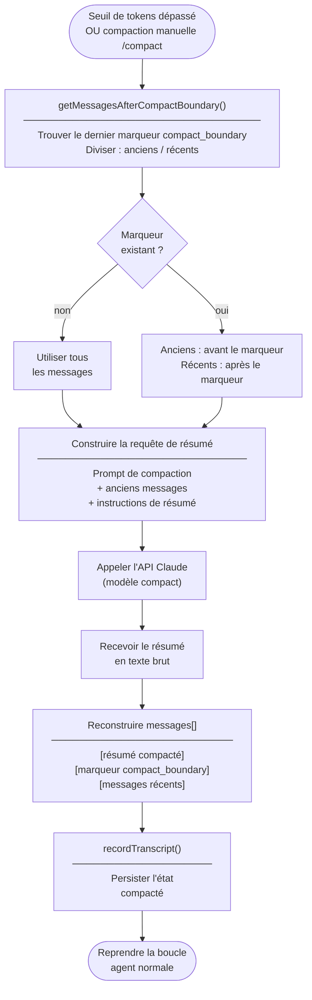
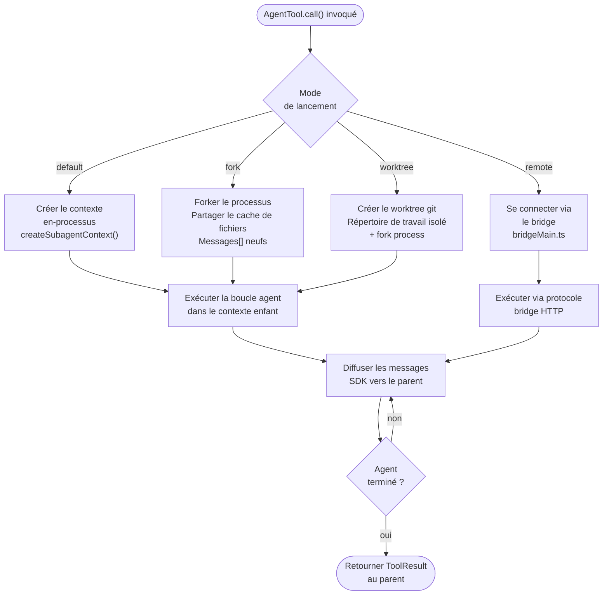

# Diagramme d'activité — Claude Code v2.1.88

Flux d'exécution de la boucle agent principale (`query.ts` / `QueryEngine.ts`).

## Boucle agent principale

```mermaid
flowchart TD
    Start([Entrée utilisateur reçue]) --> ProcessInput

    ProcessInput["processUserInput()\n─────────────────\nAnalyser les commandes slash\nConstruire UserMessage\nGérer les fichiers joints"]

    ProcessInput --> IsSlashCmd{Commande\nslash ?}
    IsSlashCmd -- oui --> ExecCmd["Exécuter la commande\n(/plan, /config, /login…)"]
    ExecCmd --> End([Fin])
    IsSlashCmd -- non --> FetchPrompt

    FetchPrompt["fetchSystemPromptParts()\n──────────────────────────\nAssembler le prompt système\nInjecter les outils actifs\nCharger les fichiers CLAUDE.md\nAppliquer les règles de permissions"]

    FetchPrompt --> RecordUser["recordTranscript()\n────────────────────\nPersister le message\nutilisateur en JSONL"]

    RecordUser --> Normalize["normalizeMessagesForAPI()\n──────────────────────────\nSupprimer les champs UI uniquement\nDédupliquer les marqueurs compact\nTronquer si nécessaire"]

    Normalize --> CheckTokens{Budget\ntokens\ndépassé ?}
    CheckTokens -- oui --> AutoCompact["autoCompact()\n───────────────\nRésumer les anciens\nmessages via API\nAjouter compact_boundary"]
    AutoCompact --> Normalize
    CheckTokens -- non --> CallAPI

    CallAPI["POST /v1/messages\n──────────────────────\nModèle + outils + prompt\nStreaming activé\nAbortController attaché"]

    CallAPI --> StreamLoop{Événement\nde stream}

    StreamLoop -- message_start --> UpdateUsage["Mettre à jour\nle compteur de tokens"]
    UpdateUsage --> StreamLoop

    StreamLoop -- content_block_delta\n(texte) --> YieldText["Émettre du texte\nvers le consommateur\n(REPL / SDK)"]
    YieldText --> StreamLoop

    StreamLoop -- content_block_delta\n(tool_use) --> BufferTool["Bufferiser le bloc\ntool_use"]
    BufferTool --> StreamLoop

    StreamLoop -- message_stop --> CheckStopReason{stop_reason ?}

    CheckStopReason -- end_turn --> RecordAssistant["recordTranscript()\n─────────────────────\nPersister le message\nassistant"]
    RecordAssistant --> YieldResult(["Émettre le message final\n(texte, usage, coût, session_id)"])

    CheckStopReason -- tool_use --> PartitionTools

    PartitionTools["StreamingToolExecutor\n──────────────────────\nPartitionner : concurrent vs série\nSûrs en parallèle : Glob, Grep, Read\nSérie : Bash, FileEdit, FileWrite"]

    PartitionTools --> ForEachTool["Pour chaque outil\n(ou groupe concurrent)"]

    ForEachTool --> ValidateInput["tool.validateInput()\n──────────────────────\nSchéma Zod + règles\nspécifiques à l'outil"]

    ValidateInput --> InputValid{Entrée\nvalide ?}
    InputValid -- non --> AppendError["Ajouter tool_result\navec message d'erreur"]
    AppendError --> NextTool

    InputValid -- oui --> RunHooks["Hooks PreToolUse\n────────────────────\nCommandes shell de l'utilisateur\nPeut : approuver/refuser/modifier"]

    RunHooks --> HookResult{Décision\ndu hook ?}
    HookResult -- refuser --> AppendDenied["Ajouter tool_result\nrefus de permission"]
    AppendDenied --> NextTool

    HookResult -- approuver --> CheckRules
    HookResult -- pas de hook --> CheckRules

    CheckRules["Vérifier les règles de permissions\n───────────────────────────────────\nalwaysAllowRules → approuver auto\nalwaysDenyRules  → refuser auto\nalwaysAskRules   → forcer l'invite"]

    CheckRules --> RuleMatch{Règle\ncorrespond ?}

    RuleMatch -- toujours autoriser --> CallTool
    RuleMatch -- toujours refuser --> AppendDenied
    RuleMatch -- pas de règle --> PromptUser

    PromptUser["Invite interactive\n────────────────────\nAfficher nom outil + entrée\nAutoriser une fois / Toujours / Refuser"]
    PromptUser --> UserDecision{Décision\nutilisateur}
    UserDecision -- refuser --> AppendDenied
    UserDecision -- autoriser --> CheckToolPerms

    CheckToolPerms["tool.checkPermissions()\n──────────────────────────\nLogique spécifique à l'outil\n(ex. sandboxing de chemin)"]
    CheckToolPerms --> PermOk{Permission\naccordée ?}
    PermOk -- non --> AppendDenied
    PermOk -- oui --> CallTool

    CallTool["tool.call(args, context)\n─────────────────────────\nExécuter la logique de l'outil\nÉmettre les événements de progression\nRetourner ToolResult"]

    CallTool --> ToolError{Erreur\nd'outil ?}
    ToolError -- oui --> AppendToolError["Ajouter tool_result\navec détails de l'erreur"]
    AppendToolError --> NextTool
    ToolError -- non --> AppendResult["Ajouter tool_result\nau tableau messages[]\nrecordTranscript()"]
    AppendResult --> NextTool

    NextTool{Autres\noutils ?}
    NextTool -- oui --> ForEachTool
    NextTool -- non --> CheckAbort

    CheckAbort{Signal\nd'abandon ?}
    CheckAbort -- oui --> YieldAbort(["Émettre AbortError"])
    CheckAbort -- non --> Normalize
```

---

## Flux de compaction du contexte

---

## Flux de lancement d'un sous-agent

