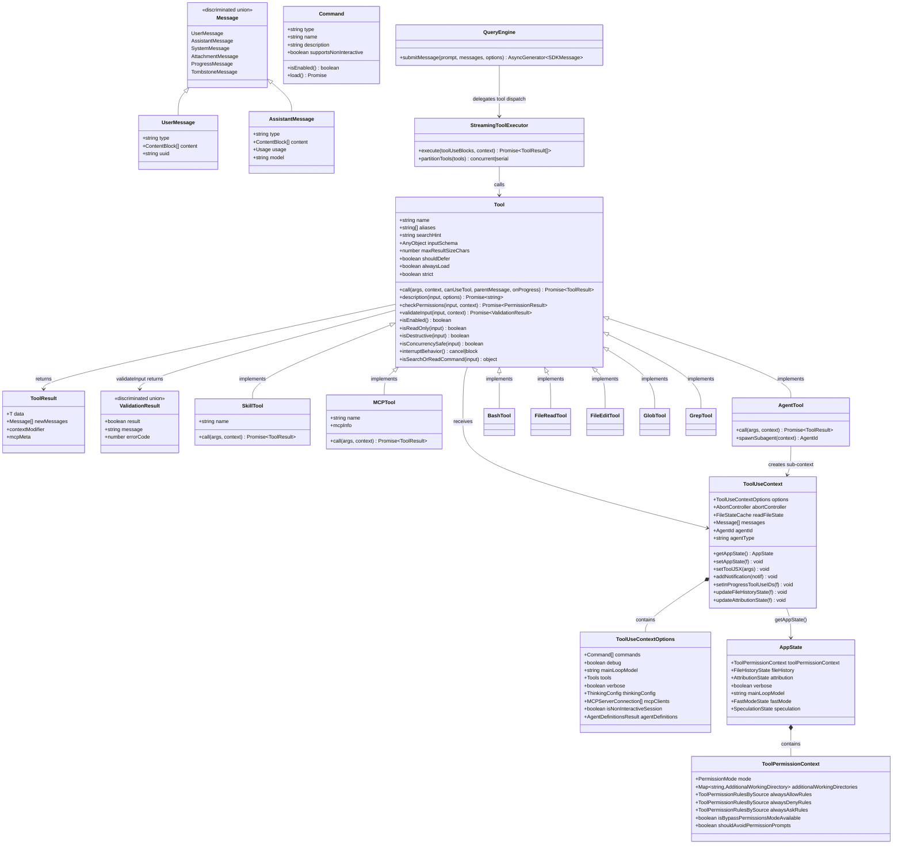
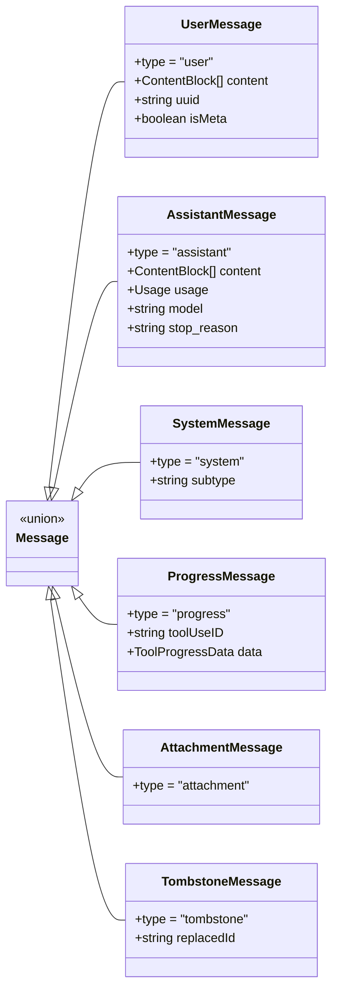
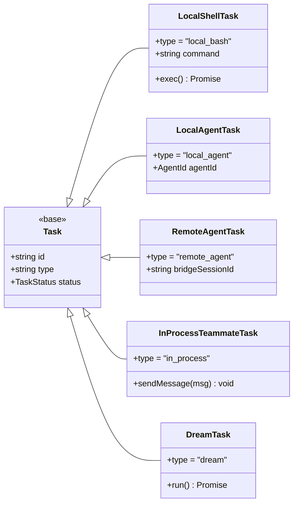

# Diagramme de classes — Claude Code v2.1.88

Types et relations fondamentaux du système.

```mermaid
classDiagram
    direction TB

    class Tool {
        +string name
        +string[] aliases
        +string searchHint
        +AnyObject inputSchema
        +number maxResultSizeChars
        +boolean shouldDefer
        +boolean alwaysLoad
        +boolean strict
        +call(args, context, canUseTool, parentMessage, onProgress) Promise~ToolResult~
        +description(input, options) Promise~string~
        +checkPermissions(input, context) Promise~PermissionResult~
        +validateInput(input, context) Promise~ValidationResult~
        +isEnabled() boolean
        +isReadOnly(input) boolean
        +isDestructive(input) boolean
        +isConcurrencySafe(input) boolean
        +interruptBehavior() cancel|block
        +isSearchOrReadCommand(input) object
    }

    class ToolUseContext {
        +ToolUseContextOptions options
        +AbortController abortController
        +FileStateCache readFileState
        +Message[] messages
        +AgentId agentId
        +string agentType
        +getAppState() AppState
        +setAppState(f) void
        +setToolJSX(args) void
        +addNotification(notif) void
        +setInProgressToolUseIDs(f) void
        +updateFileHistoryState(f) void
        +updateAttributionState(f) void
    }

    class ToolUseContextOptions {
        +Command[] commands
        +boolean debug
        +string mainLoopModel
        +Tools tools
        +boolean verbose
        +ThinkingConfig thinkingConfig
        +MCPServerConnection[] mcpClients
        +boolean isNonInteractiveSession
        +AgentDefinitionsResult agentDefinitions
    }

    class ToolResult {
        +T data
        +Message[] newMessages
        +contextModifier
        +mcpMeta
    }

    class ValidationResult {
        <<discriminated union>>
        +boolean result
        +string message
        +number errorCode
    }

    class AppState {
        +ToolPermissionContext toolPermissionContext
        +FileHistoryState fileHistory
        +AttributionState attribution
        +boolean verbose
        +string mainLoopModel
        +FastModeState fastMode
        +SpeculationState speculation
    }

    class ToolPermissionContext {
        +PermissionMode mode
        +Map~string,AdditionalWorkingDirectory~ additionalWorkingDirectories
        +ToolPermissionRulesBySource alwaysAllowRules
        +ToolPermissionRulesBySource alwaysDenyRules
        +ToolPermissionRulesBySource alwaysAskRules
        +boolean isBypassPermissionsModeAvailable
        +boolean shouldAvoidPermissionPrompts
    }

    class Message {
        <<discriminated union>>
        UserMessage
        AssistantMessage
        SystemMessage
        AttachmentMessage
        ProgressMessage
        TombstoneMessage
    }

    class UserMessage {
        +string type
        +ContentBlock[] content
        +string uuid
    }

    class AssistantMessage {
        +string type
        +ContentBlock[] content
        +Usage usage
        +string model
    }

    class Command {
        +string type
        +string name
        +string description
        +boolean supportsNonInteractive
        +isEnabled() boolean
        +load() Promise
    }

    class QueryEngine {
        +submitMessage(prompt, messages, options) AsyncGenerator~SDKMessage~
    }

    class StreamingToolExecutor {
        +execute(toolUseBlocks, context) Promise~ToolResult[]~
        +partitionTools(tools) concurrent|serial
    }

    class SkillTool {
        +string name
        +call(args, context) Promise~ToolResult~
    }

    class MCPTool {
        +string name
        +mcpInfo
        +call(args, context) Promise~ToolResult~
    }

    class AgentTool {
        +call(args, context) Promise~ToolResult~
        +spawnSubagent(context) AgentId
    }

    %% Inheritance / implementation
    Tool <|-- SkillTool : implements
    Tool <|-- MCPTool : implements
    Tool <|-- AgentTool : implements
    Tool <|-- BashTool : implements
    Tool <|-- FileReadTool : implements
    Tool <|-- FileEditTool : implements
    Tool <|-- GlobTool : implements
    Tool <|-- GrepTool : implements

    %% Compositions
    ToolUseContext *-- ToolUseContextOptions : contains
    ToolUseContext --> AppState : getAppState()
    AppState *-- ToolPermissionContext : contains
    Message <|-- UserMessage
    Message <|-- AssistantMessage

    %% Uses
    Tool --> ToolUseContext : receives
    Tool --> ToolResult : returns
    Tool --> ValidationResult : validateInput returns
    QueryEngine --> StreamingToolExecutor : delegates tool dispatch
    StreamingToolExecutor --> Tool : calls
    AgentTool --> ToolUseContext : creates sub-context
```

---

## Hiérarchie des types de messages

```mermaid
classDiagram
    direction LR

    class Message {
        <<union>>
    }
    class UserMessage {
        +type = "user"
        +ContentBlock[] content
        +string uuid
        +boolean isMeta
    }
    class AssistantMessage {
        +type = "assistant"
        +ContentBlock[] content
        +Usage usage
        +string model
        +string stop_reason
    }
    class SystemMessage {
        +type = "system"
        +string subtype
    }
    class ProgressMessage {
        +type = "progress"
        +string toolUseID
        +ToolProgressData data
    }
    class AttachmentMessage {
        +type = "attachment"
    }
    class TombstoneMessage {
        +type = "tombstone"
        +string replacedId
    }

    Message <|-- UserMessage
    Message <|-- AssistantMessage
    Message <|-- SystemMessage
    Message <|-- ProgressMessage
    Message <|-- AttachmentMessage
    Message <|-- TombstoneMessage
```

---

## Hiérarchie des types de tâches

```mermaid
classDiagram
    direction LR

    class Task {
        <<base>>
        +string id
        +string type
        +TaskStatus status
    }
    class LocalShellTask {
        +type = "local_bash"
        +string command
        +exec() Promise
    }
    class LocalAgentTask {
        +type = "local_agent"
        +AgentId agentId
    }
    class RemoteAgentTask {
        +type = "remote_agent"
        +string bridgeSessionId
    }
    class InProcessTeammateTask {
        +type = "in_process"
        +sendMessage(msg) void
    }
    class DreamTask {
        +type = "dream"
        +run() Promise
    }

    Task <|-- LocalShellTask
    Task <|-- LocalAgentTask
    Task <|-- RemoteAgentTask
    Task <|-- InProcessTeammateTask
    Task <|-- DreamTask
```
