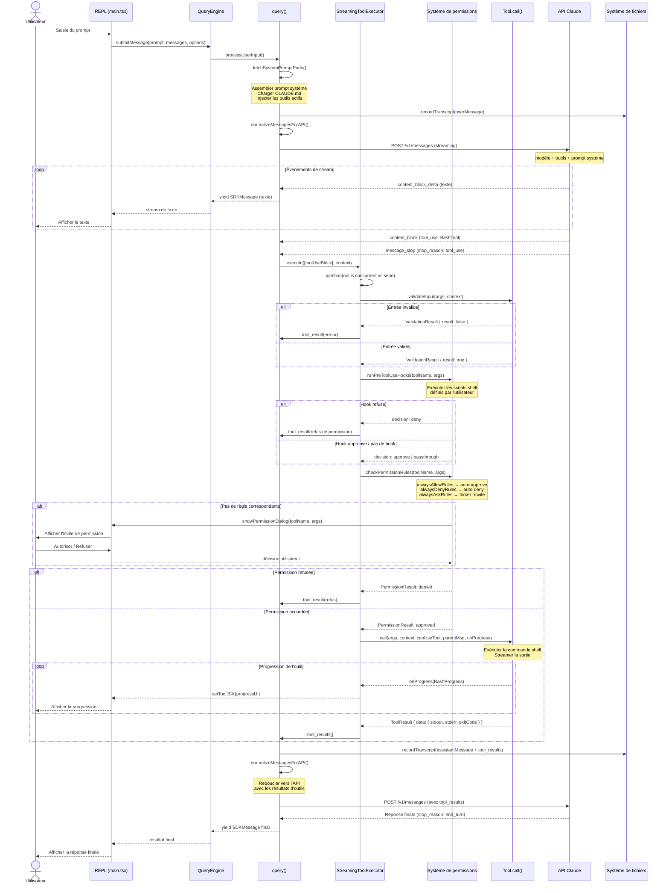
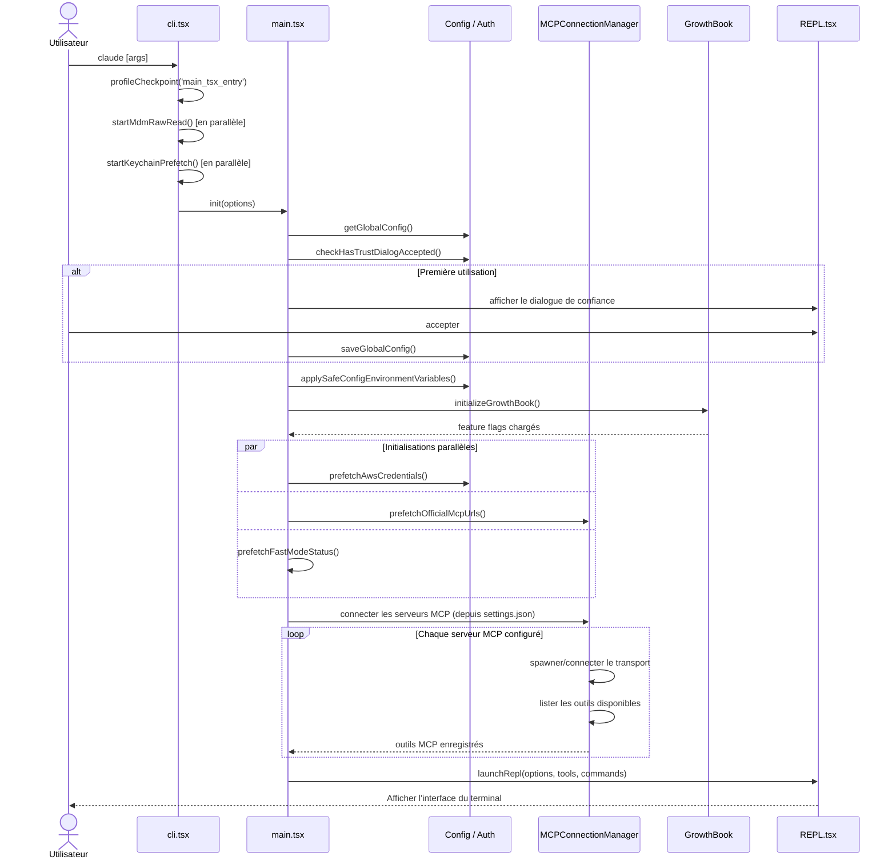
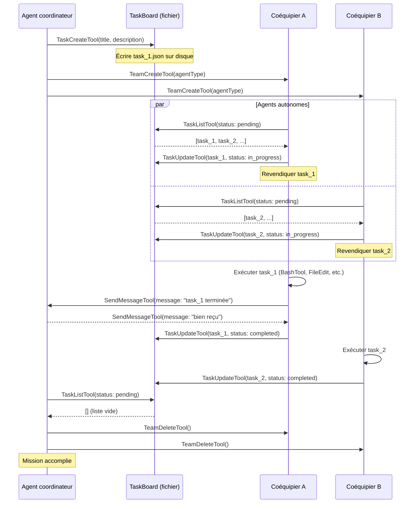
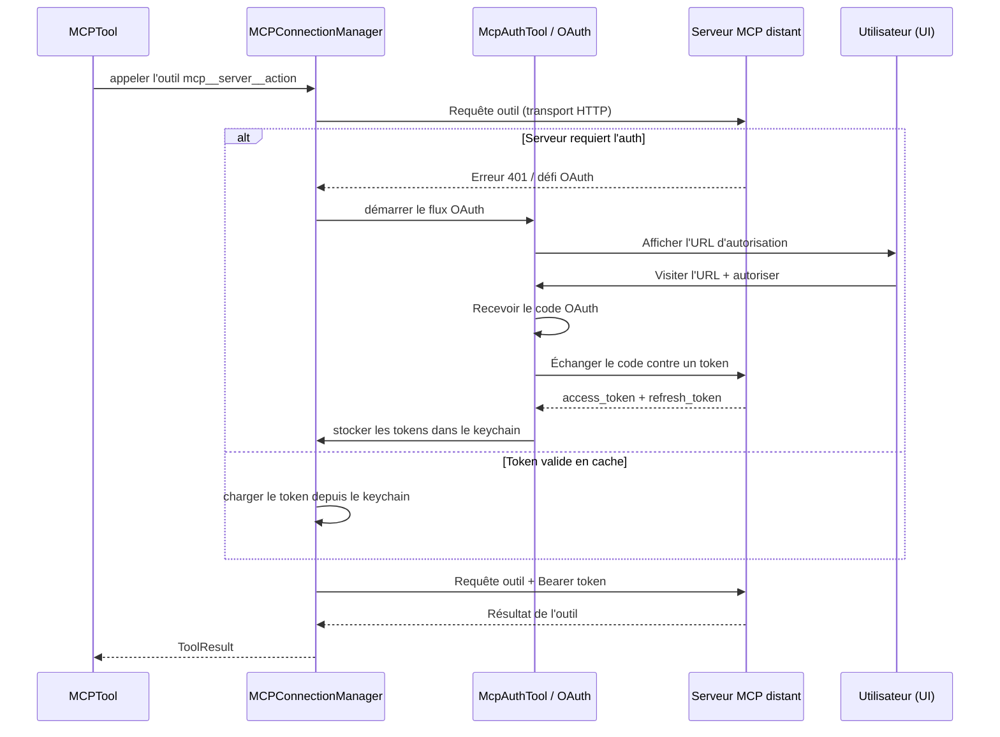
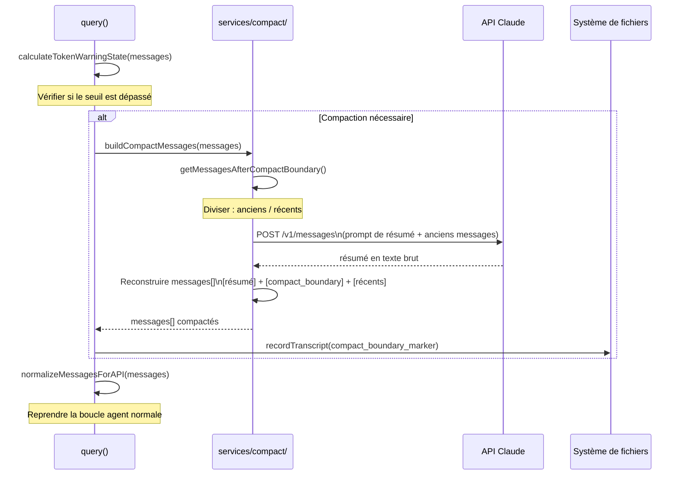

# Diagramme de séquence — Claude Code v2.1.88

Interactions dynamiques entre les composants pour les scénarios clés.

## Cycle de vie complet d'un appel d'outil

---

## Démarrage et initialisation de la session

---

## Protocole de communication inter-agents

---

## Flux d'authentification OAuth MCP

---

## Flux de compaction du contexte

